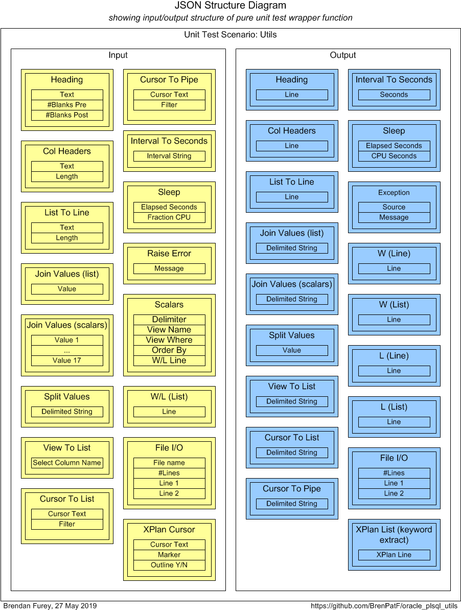
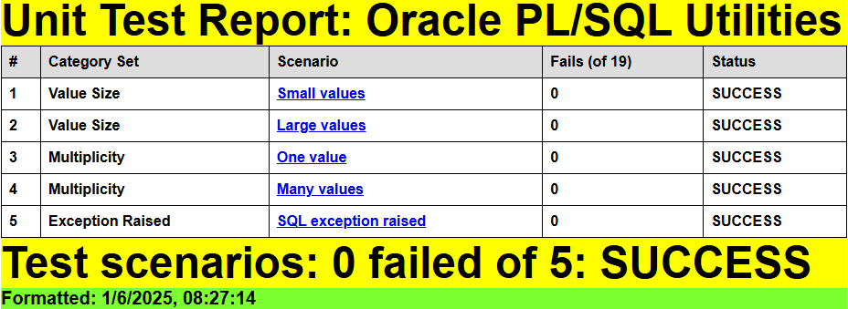
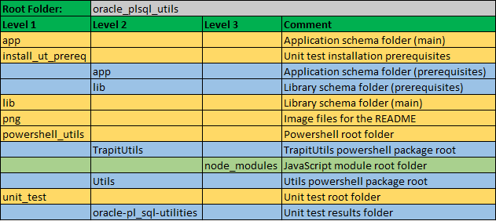

# Utils

Oracle PL/SQL General Utilities Module

:hammer_and_wrench:

This module comprises a set of generic user-defined Oracle types and a PL/SQL package of functions and procedures of general utility. It includes functions and procedures for:
- 'pretty-printing'
- returning records from cursors or views/tables as lists of delimited strings
- joining lists of values into delimited strings, and the converse splitting operation
- wrapping file I/O APIs
- wrapping calls to execution plan APIs

This module is a prerequisite for these other Oracle GitHub modules:
- [Trapit - Oracle PL/SQL unit testing module](https://github.com/BrenPatF/trapit_oracle_tester)
- [Log_Set - Oracle logging module](https://github.com/BrenPatF/log_set_oracle)
- [Timer_Set - Oracle PL/SQL code timing module](https://github.com/BrenPatF/timer_set_oracle)

The package is tested using [The Math Function Unit Testing Design Pattern](https://brenpatf.github.io/2023/06/05/the-math-function-unit-testing-design-pattern.html), with test results in HTML and text format included.

The module also comes with examples of usage.

There is a short (2m20s) installation demo, install_plsql_utils_demo.mp4, in the project root.

# In this README...
[&darr; Usage (extract from main_col_group.sql)](#usage-extract-from-main_col_groupsql)<br />
[&darr; API - Utils](#api---utils)<br />
[&darr; Installation](#installation)<br />
[&darr; Unit Testing](#unit-testing)<br />
[&darr; Folder Structure](#folder-structure)<br />
[&darr; See Also](#see-also)<br />
## Usage (extract from main_col_group.sql)
[&uarr; In this README...](#in-this-readme)<br />

```sql
DECLARE
  l_res_arr              chr_int_arr;
BEGIN

  Col_Group.Load_File(p_file   => 'fantasy_premier_league_player_stats.csv',
                      p_delim  => ',',
                      p_colnum => 7);
  l_res_arr := Col_Group.List_Asis;
  Utils.W(p_line_lis => Utils.Heading(p_head => 'As Is'));

  Utils.W(p_line_lis => Utils.Col_Headers(p_value_lis => chr_int_arr(chr_int_rec('Team', 30),
                                                                     chr_int_rec('Apps', -5)
  )));

  FOR i IN 1..l_res_arr.COUNT LOOP
    Utils.W(p_line => Utils.List_To_Line(
                          p_value_lis => chr_int_arr(chr_int_rec(p_res_arr(i).chr_value, 30),
                                                     chr_int_rec(p_res_arr(i).int_value, -5)
    )));
  END LOOP;

END;
```

The main_col_group.sql script gives examples of usage for all the functions and procedures in the Utils package. In the extract above, an example package, Col_Group, is called to read and process a CSV file, with calls to Utils procedures and functions to 'pretty-print' a listing at the end:

```
As Is
=====
Team                             Apps
------------------------------  -----
team_name_2                         1
Blackburn                          33
...

```
To run the example script in a slqplus session from app subfolder (after installation):

```
SQL> @main_col_group
```

There is also a separate [module](https://github.com/BrenPatF/oracle_plsql_api_demos) demonstrating instrumentation and logging, code timing and unit testing of Oracle PL/SQL APIs, which uses this module.
## API - Utils
[&uarr; In this README...](#in-this-readme)<br />
[&darr; Heading](#heading)<br />
[&darr; Col_Headers](#col_headers)<br />
[&darr; List_To_Line](#list_to_line)<br />
[&darr; Join_Values [list parameter]](#join_values-list-parameter)<br />
[&darr; Join_Values [scalar parameters]](#join_values-scalar-parameters)<br />
[&darr; Split_Values](#split_values)<br />
[&darr; View_To_List](#view_to_list)<br />
[&darr; Cursor_To_List](#cursor_to_list)<br />
[&darr; Cursor_To_Pipe](#cursor_to_pipe)<br />
[&darr; IntervalDS_To_Seconds](#intervalds_to_seconds)<br />
[&darr; Sleep](#sleep)<br />
[&darr; Raise_Error](#raise_error)<br />
[&darr; W [scalar parameter]](#w-scalar-parameter)<br />
[&darr; W [list parameter]](#w-list-parameter)<br />
[&darr; Delete_File](#delete_file)<br />
[&darr; Write_File](#write_file)<br />
[&darr; Read_File](#read_file)<br />
[&darr; Get_XPlan](#get_xplan)<br />

This package runs with Invoker rights, not the default Definer rights, so that the dynamic SQL methods execute SQL using the rights of the calling schema, not the lib schema (if different).

### Heading
[&uarr; API - Utils](#api---utils)<br />
```plsql
l_heading_lis L1_chr_arr := Utils.Heading(p_head);
```
Returns a 2-element string array consisting of the string passed in and a string of underlining '=' of the same length, with parameters as follows:

* `p_head`: string to be used as a heading

### Col_Headers
[&uarr; API - Utils](#api---utils)<br />
```plsql
l_headers_lis L1_chr_arr := Utils.Col_Headers(p_value_lis);
```
Returns a 2-element string array consisting of a string containing the column headers passed in, justified as specified, and a string of sets of underlining '-' of the same lengths as the justified column headers, with parameters as follows:

* `p_value_lis`: chr_int_arr type, array of objects of type chr_int_rec:
  * `chr_value`: column header text
  * `int_value`: field size for the column header, right-justify if < 0, else left-justify

### List_To_Line
[&uarr; API - Utils](#api---utils)<br />
```plsql
l_line VARCHAR2(4000) := Utils.List_To_Line(p_value_lis);
```
Returns a string containing the values passed in as a list of tuples, justified as specified in the second element of the tuple, with parameters as follows:
* `p_value_lis`: chr_int_arr type, array of objects of type chr_int_rec:
  * `chr_value`: value text
  * `int_value`: field size for the value, right-justify if < 0, else left-justify

### Join_Values [list parameter]
[&uarr; API - Utils](#api---utils)<br />
```plsql
l_line VARCHAR2(4000) := Utils.Join_Values(p_value_lis, `optional parameters`);
```
Returns a string containing the values passed in as a list of strings, delimited by the optional p_delim parameter that defaults to '|', with parameters as follows:
* `p_value_lis`: list of strings

Optional parameters:
* `p_delim`: delimiter string, defaults to '|'

### Join_Values [scalar parameters]
[&uarr; API - Utils](#api---utils)<br />
```plsql
l_line VARCHAR2(4000) := Utils.Join_Values(p_value1, `optional parameters`);
```
Returns a string containing the values passed in as distinct parameters, delimited by the optional p_delim parameter that defaults to '|', with parameters as follows:
* `p_value1`: mandatory first value

Optional parameters:
* `p_value2-p_value17`: 16 optional values, defaulting to the constant PRMS_END. The first defaulted value encountered acts as a list terminator
* `p_delim`: delimiter string, defaults to '|'

### Split_Values
[&uarr; API - Utils](#api---utils)<br />
```plsql
l_value_lis L1_chr_arr := Utils.Split_Values(p_string, `optional parameters`);
```
Returns a list of string values obtained by splitting the input string on a given delimiter, with parameters as follows:

* `p_string`: string to split

Optional parameters:
* `p_delim`: delimiter string, defaults to '|'

### View_To_List
[&uarr; API - Utils](#api---utils)<br />
```plsql
l_row_lis L1_chr_arr := Utils.View_To_List(p_view_name, p_sel_value_lis, `optional parameters`);
```
Returns a list of rows returned from the specified view/table, with specified column list and where clause, delimiting values with specified delimiter, with parameters as follows:

* `p_view_name`: name of table or view
* `p_sel_value_lis`: L1_chr_arr list of columns to select

Optional parameters:
* `p_where`: where clause, omitting WHERE key-word
* `p_delim`: delimiter string, defaults to '|'

### Cursor_To_List
[&uarr; API - Utils](#api---utils)<br />
This function takes an open cursor and returns the result set in the form of a list of delimited strings. It will throw an error if there are more than 32,767 records in the result set; in that case, the pipelined function version, Cursor_To_Pipe, can be used.
```plsql
DECLARE
  l_csr         SYS_REFCURSOR;
  l_res_lis     L1_chr_arr;
BEGIN
  ...[l_csr should be set]
  l_res_lis := Utils.Cursor_To_List(x_csr => l_csr, `optional parameters`);
END;
```
Returns a list of rows from the ref cursor passed, delimiting values with specified delimiter, with filter clause applied via RegExp_Like to the delimited rows, with parameters as follows:

* `x_csr`: IN OUT SYS_REFCURSOR, passed as open, and closed in function after processing

Optional parameters:
* `p_filter`: filter clause, regex expression passed to RegExp_Like against output line
* `p_delim`: delimiter string, defaults to '|'

### Cursor_To_Pipe
[&uarr; API - Utils](#api---utils)<br />
This is a pipelined function that takes an open cursor and returns the result set in the form of  delimited strings fetched using an SQL query. Its use must be preceded by a call to Prep_Cursor, which converts the input REF cursor into a DBMS_SQL cursor, and whose return value is passed to Cursor_To_Pipe as a parameter.

```plsql
DECLARE
  l_csr         SYS_REFCURSOR;
  l_res_lis     L1_chr_arr;
  l_cursor_rec  Utils.cursor_rec;
BEGIN
  ...[l_csr should be set]
  l_cursor_rec := Utils.Prep_Cursor(x_csr => l_csr);
  SELECT COLUMN_VALUE
    BULK COLLECT INTO l_res_lis
    FROM TABLE(Utils.Pipe_Cursor(p_cursor_rec => l_cursor_rec, `optional parameters`));
  DBMS_SQL.Close_Cursor(l_cursor_rec.csr_id);
END;
```
Returns a list of rows from the ref cursor passed, delimiting values with specified delimiter, with filter clause applied via RegExp_Like to the delimited rows, with parameters as follows:

* `x_csr`: IN OUT SYS_REFCURSOR, passed to Prep_Cursor as open, and should be closed via a call to DBMS_SQL.Close_Cursor, after processing of the pipelined function result set

Optional parameters:
* `p_filter`: filter clause, regex expression passed to RegExp_Like against output line
* `p_delim`: delimiter string, defaults to '|'

Technical parameter:
* `p_cursor_rec`: used to pass in the record returned from Prep_Cursor to Pipe_Cursor

### IntervalDS_To_Seconds
[&uarr; API - Utils](#api---utils)<br />
```plsql
l_seconds NUMBER := Utils.IntervalDS_To_Seconds(p_interval);
```
Returns the number of seconds in a day-to-second interval, with parameters as follows:

* `p_interval`: INTERVAL DAY TO SECOND

### Sleep
[&uarr; API - Utils](#api---utils)<br />
```plsql
Utils.Sleep(p_ela_seconds, `optional parameters`);
```
Sleeps for a given number of seconds elapsed time, including a 'target' proportion of CPU time, with both numbers approximate, with parameters as follows:

* `p_ela_seconds`: elapsed time to sleep

Optional parameters
* `p_fraction_CPU`: target fraction of elapsed time to use CPU, default 0.5

Note that the actual fraction of CPU usage is generally some way below target.

### Raise_Error
[&uarr; API - Utils](#api---utils)<br />
```plsql
Utils.Raise_Error(p_message);
```
Raises an error using Raise_Application_Error with fixed error number of 20000, with parameters as follows:

* `p_message`: error message

### W [scalar parameter]
[&uarr; API - Utils](#api---utils)<br />
```plsql
Utils.W(p_line);
```
Writes a line of text using DBMS_Output.Put_line, with parameters as follows:

* `p_line`: line of text to write

### W [list parameter]
[&uarr; API - Utils](#api---utils)<br />
```plsql
Utils.W(p_line_lis);
```
Writes a list of lines of text using DBMS_Output.Put_line, with parameters as follows:

* `p_line_lis`: L1_chr_arr list of lines of text to write

### Delete_File
[&uarr; API - Utils](#api---utils)<br />
```plsql
Utils.Delete_File(p_file_name);
```
Deletes a file on database server, in `input_dir`, with parameters as follows:

* `p_file_name`: file name

### Write_File
[&uarr; API - Utils](#api---utils)<br />
```plsql
Utils.Write_File(p_file_name, p_line_lis);
```
Writes a list of lines to a file on database server, in `input_dir`, with parameters as follows:

* `p_file_name`: file name
* `p_line_lis`: list of lines to write

The file is opened and closed within the procedure.

### Read_File
[&uarr; API - Utils](#api---utils)<br />
```plsql
l_lines_lis L1_chr_arr := Utils.Read_File(p_file_name);
```
Returns contents of a file on database server, in `input_dir`, into a list of lines, with parameters as follows:

* `p_file_name`: file name

The file is opened and closed within the function.

### Get_XPlan
[&uarr; API - Utils](#api---utils)<br />
```plsql
l_lines_lis L1_chr_arr := Utils.Get_XPlan(p_sql_marker, `optional parameters`);
```
Returns execution plan for a recently excuted query, identified by a marker string, into a list of lines, with parameters as follows:

* `p_sql_marker`: marker string

Optional parameters:
* `p_add_outline`: boolean, if TRUE return plan outline after normal execution plan, defaults to FALSE

The executed query should contain a hint of the form /*+  gather_plan_statistics  `p_sql_marker` */. Check the  main_col_group.sql script for an example of usage.
## Installation
[&uarr; In this README...](#in-this-readme)<br />
[&darr; Prerequisite Applications](#prerequisite-applications)<br />
[&darr; Oracle Installs](#oracle-installs)<br />
[&darr; Powershell and JavaScript Packages](#powershell-and-javascript-packages)<br />

### Prerequisite Applications
[&uarr; Installation](#installation)<br />
[&darr; Oracle Client](#oracle-client)<br />
[&darr; Node.js](#nodejs)<br />
[&darr; Powershell](#powershell)<br />

#### Oracle Client
[&uarr; Prerequisite Applications](#prerequisite-applications)<br />

An Oracle client is required, including SQL\*Plus, with access to an Oracle database:

- [Oracle Instant Client Downloads for Microsoft Windows (x64) 64-bit](https://www.oracle.com/ie/database/technologies/instant-client/winx64-64-downloads.html)

#### Node.js
[&uarr; Prerequisite Applications](#prerequisite-applications)<br />

The unit test results are formatted using a JavaScript program, which is included as part of the current project. Running the program requires the Node.js application:

- [Node.js Downloads](https://nodejs.org/en/download)

#### Powershell
[&uarr; Prerequisite Applications](#prerequisite-applications)<br />

Powershell is optional, and is used in the project for automation purposes, and for generating a template for the JSON input file required by the Math Function Unit Testing design pattern:

- [Installing Windows PowerShell](https://learn.microsoft.com/en-us/powershell/scripting/windows-powershell/install/installing-windows-powershell)


### Oracle Installs
[&uarr; Installation](#installation)<br />
[&darr; Automated Installation](#automated-installation)<br />
[&darr; Manual Installation](#manual-installation)<br />

The Oracle installation can be performed via a single powershell script, or in a series of smaller steps.

#### Automated Installation
[&uarr; Oracle Installs](#oracle-installs)<br />

The Oracle installation can be performed simply by running the following script, Install-Utils.ps1:

##### [Folder: (module root)]

```powershell
.\Install-Utils
```

Some points to note:
- This script copies two files to a folder "c:/input", creating it if it does not exist, and aborting if it exists as a file
- It tries to create lib and app schemas using sys schema, with all passwords assumed to be the  usernames, and TNS alias orclpdb
- There is a script drop_utils_users.sql that can be run manually first to drop those schemas if they exist, or uncommented from the powershell script

##### [Schema: sys; Folder: (module root)] Drop lib and app schemas
```sql
SQL> @drop_utils_users
```

#### Manual Installation
[&uarr; Oracle Installs](#oracle-installs)<br />
[&darr; File System Installs](#file-system-installs)<br />
[&darr; Database Installs](#database-installs)<br />

##### File System Installs
[&uarr; Manual Installation](#manual-installation)<br />

- Copy the following files to the server folder pointed to by the Oracle directory INPUT_DIR:

    - fantasy_premier_league_player_stats.csv
    - unit_test/tt_utils.purely_wrap_utils_inp.json

- There is also a powershell script to do this, assuming C:\input as INPUT_DIR. From a powershell window in the root folder:
```powershell
$ ./Copy-DataFilesInput.ps1
```

##### Database Installs
[&uarr; Manual Installation](#manual-installation)<br />
[&darr; Create lib and app schemas and Oracle directory (optional)](#create-lib-and-app-schemas-and-oracle-directory-optional)<br />
[&darr; Install Utils components](#install-utils-components)<br />
[&darr; Install Trapit module](#install-trapit-module)<br />
[&darr; Install unit test code](#install-unit-test-code)<br />
[&darr; Install components for example code](#install-components-for-example-code)<br />

The Oracle database installation is implemented through a small number of driver scripts: Usually one per Oracle schema and folder, but separating out some files.

| Script                | Schema | Folder             | Purpose                                                |
|:----------------------|:-------|:-------------------|:-------------------------------------------------------|
| drop_utils_users.sql  | sys    | (module root)      | Drop lib and app schemas and Oracle directory          |
| install_sys.sql       | sys    | (module root)      | Create lib and app schemas and Oracle directory        |
| install_utils.sql     | lib    | lib                | Install lib components                                 |
| install_lib_all.sql   | lib    | install_prereq\lib | Install Trapit module in lib                           |
| c_syns_all.sql        | app    | install_prereq\app | Create app synonyms for Trapit to lib                  |
| install_utils_tt.sql  | lib    | lib                | Install app base components                            |
| install_col_group.sql | app    | app                | Install example components in app (and Utils synonyms) |

###### Create lib and app schemas and Oracle directory (optional)
[&uarr; Database Installs](#database-installs)<br />

You can install just the base module in an existing schema, or alternatively, install base module plus an example of usage, and unit testing code, in two new schemas, `lib` and `app`.

##### [Schema: sys; Folder: (module root)]
- install_sys.sql creates an Oracle directory, `input_dir`, pointing to 'c:\input'. Update this if necessary to a folder on the database server with read/write access for the Oracle OS user
- Run script from slqplus:
```sql
SQL> @install_sys
```

To repeat an install you can first revert using drop_utils_users.sql.

If you do not create new users, subsequent installs will be from whichever schemas are used instead of lib and app.

###### Install Utils components
[&uarr; Database Installs](#database-installs)<br />
##### [Schema: lib; Folder: lib]
- Run script from slqplus:
```sql
SQL> @install_utils app
```

This creates the required components for the base install along with grants for them to the app schema (passing none instead of app will bypass the grants). This install is all that is required to use the package and object types within the lib schema and app (if passed). To grant privileges to any `schema`, run the grants script directly, passing `schema`:
```sql
SQL> @grant_utils_to_app schema
```

###### Install Trapit module
[&uarr; Database Installs](#database-installs)<br />

The module can be installed from its own Github page: [Trapit on GitHub](https://github.com/BrenPatF/trapit_oracle_tester). Alternatively, it can be installed directly here as follows:

##### [Schema: lib; Folder: install_ut_prereq\lib] Create lib components
- Run script from slqplus:
```sql
SQL> @install_lib_all
```

##### [Schema: app; Folder: install_ut_prereq\app] Create app synonyms for Trapit to lib
- Run script from slqplus:
```sql
SQL> @c_syns_all
```

###### Install unit test code
[&uarr; Database Installs](#database-installs)<br />

This step requires the Trapit module option to have been installed via the previous install step above.

##### [Schema: lib; Folder: lib] Install unit test code
- Run script from slqplus:
```sql
SQL> @install_utils_tt
```

###### Install components for example code
[&uarr; Database Installs](#database-installs)<br />

##### [Schema: app; Folder: app] Install example components
- Run script from slqplus:
```sql
SQL> @install_col_group lib
```

You can review the results from the example code in the `app` subfolder without doing this install. This install creates private synonyms to the lib schema. To create synonyms within another schema, run the synonyms script directly from that schema, passing lib schema:
```sql
SQL> @c_utils_syns lib
```

### Powershell and JavaScript Packages
[&uarr; Installation](#installation)<br />
[&darr; Format-JSON-Utils.ps1](#format-json-utilsps1)<br />
[&darr; Test-Format-Utils.ps1](#test-format-utilsps1)<br />

As noted in the Prerequisite Applications section, JavaScript is used to format unit test results, and Powershell is optionally used for automation purposes, and for generating a template for the JSON input file required by the Math Function Unit Testing design pattern.

Both JavaScript and Powershell packages have their own GitHub projects:

- [Trapit - JavaScript Unit Tester/Formatter](https://github.com/BrenPatF/trapit_nodejs_tester)
- [Powershell utilities module](https://github.com/BrenPatF/powershell_utils)

However, for convenience the packages are included in the current project folder structure, rooted in the powershell_utils subfolder, and do not require separate installation. [The examples and unit testing of the Powershell packages themselves assume installation within the Powershell path, but these are not needed for use within Oracle.]

There are two main entry points, whose usage can be seen in the current project.

#### Format-JSON-Utils.ps1
[&uarr; Powershell and JavaScript Packages](#powershell-and-javascript-packages)<br />

This is used to generate a template input JSON file for the unit under test, using a function from the Powershell package TrapitUtils, with signature:
```powershell
Write-UT_Template($stem, $delimiter)
```

#### Test-Format-Utils.ps1
[&uarr; Powershell and JavaScript Packages](#powershell-and-javascript-packages)<br />

This runs Oracle unit tests for a given test group, and includes the formatting step by means of a call to the JavaScript formatter, using a function from the Powershell package TrapitUtils, with signature:
```powershell
Test-FormatDB($unpw, $conn, $utGroup, $testRoot)
```
## Unit Testing
[&uarr; In this README...](#in-this-readme)<br />
[&darr; Step 1: Create JSON File](#step-1-create-json-file)<br />
[&darr; Step 2: Create Results Object](#step-2-create-results-object)<br />
[&darr; Step 3: Format Results](#step-3-format-results)<br />

The package is tested using [The Math Function Unit Testing Design Pattern](https://brenpatf.github.io/2023/06/05/the-math-function-unit-testing-design-pattern.html) (general overview), described in its Oracle version here: [Trapit - Oracle PL/SQL Unit Testing Module](https://github.com/BrenPatF/trapit_oracle_tester). In this approach, a 'pure' wrapper function is constructed that takes input parameters and returns a value, and is tested within a loop over scenario records read from a JSON file.

In this case, where we have a set of small independent procedures and functions, the wrapper function is designed to test all of them in a single generalised transaction (per scenario).

At a high level [The Math Function Unit Testing Design Pattern](https://brenpatf.github.io/2023/06/05/the-math-function-unit-testing-design-pattern.html) involves three main steps:

1. Create an input file containing all test scenarios with input data and expected output data for each scenario
2. Create a results object based on the input file, but with actual outputs merged in
3. Use the results object to generate unit test results files formatted in HTML and/or text


#### Step 1: Create JSON File
[&uarr; Unit Testing](#unit-testing)<br />
[&darr; Unit Test Wrapper Function](#unit-test-wrapper-function)<br />
[&darr; Scenario Category ANalysis (SCAN)](#scenario-category-analysis-scan)<br />

Step 1 requires analysis to determine the extended signature for the unit under test, and to determine appropriate scenarios to test. The results of this analysis can be summarised in three CSV files which a powershell API, `Write-UT_Template`, uses as inputs to create a template for the JSON file.

This template file, tt_utils.purely_wrap_utils_temp.json, contains the full meta section (which describes groups and fields), and a set of template scenarios having name as scenario key, a category set attribute, and a single record with default values for each input and output group.

For each scenario element, we need to update the values to reflect the scenario to be tested, in the actual input JSON file, tt_utils.purely_wrap_utils_inp.json.

##### Unit Test Wrapper Function
[&uarr; Step 1: Create JSON File](#step-1-create-json-file)<br />

Here is a diagram of the input and output groups for this example:



From the input and output groups depicted we can construct CSV files with flattened group/field structures, and default values added, as follows (with `tt_utils.purely_wrap_utils_inp.csv` left, `tt_utils.purely_wrap_utils_out.csv` right):


These form two of the three input files for the Powershell script that generates a template for the input JSON file. The third is the scenarios file, shown in the next section.

##### Scenario Category ANalysis (SCAN)
[&uarr; Step 1: Create JSON File](#step-1-create-json-file)<br />
[&darr; Generic Category Sets](#generic-category-sets)<br />
[&darr; Categories and Scenarios](#categories-and-scenarios)<br />

###### Generic Category Sets
[&uarr; Scenario Category ANalysis (SCAN)](#scenario-category-analysis-scan)<br />

As explained in the article mentioned above, it can be very useful to think in terms of generic category sets that apply in many situations. In this case, where we are testing a set of independent utilities, they are particularly useful and can be applied across many of the utilities at the same time.

###### Binary

There are many situations where a category set splits into two opposing values such as Yes / No or True / False. In this case we can use it to apply to whether an exception is raised.

| Code | Description     |
|:----:|:----------------|
| Yes  | Yes / True etc. |
| No   | No / False etc. |

###### Value Size

We may wish to check that functions work correctly for both large and small parameter or other data values.

| Code   | Description  |
|:------:|:-------------|
| Small  | Small values |
| Large  | Large values |

###### Multiplicity

The generic category set of multiplicity is applicable very frequently, and we should check each of the relevant categories. In some cases we'll want to check None / One / Multiple instance categories, but in this case we'll use One / Many.

| Code     | Description     |
|:--------:|:----------------|
| One      | One value       |
| Many     | Many values     |

###### Categories and Scenarios
[&uarr; Scenario Category ANalysis (SCAN)](#scenario-category-analysis-scan)<br />

After analysis of the possible scenarios in terms of categories and category sets, we can depict them on a Category Structure diagram:


In this case, we can apply the generic category sets identified to the set of mostly independent utility programs. We can tabulate the results of the category analysis, and assign a scenario against each category set/category with a unique description:

|  # | Category Set     | Category | Scenario             |
|---:|:-----------------|:---------|:---------------------|
|  1 | Value Size       | Small    | Small values         |
|  2 | Value Size       | Large    | Large values         |
|  3 | Multiplicity     | One      | One value            |
|  4 | Multiplicity     | Many     | Many values          |
|  5 | Exception Raised | Yes      | SQL exception raised |

In this case we are not creating a specific scenario for the 'Exception Raised / No' category, since this is covered by all of the first four scenarios.

From the scenarios identified we can construct the following CSV file (`tt_utils.purely_wrap_utils_sce.csv`), taking the category set and scenario columns, and adding an initial value for the active flag:


The powershell API to generate the template JSON file can be run with the following powershell in the folder of the CSV files:

```powershell
Import-Module ..\powershell_utils\TrapitUtils\TrapitUtils
Write-UT_Template 'tt_utils.purely_wrap_utils' ';'
```
This creates the template JSON file, tt_utils.purely_wrap_utils_temp.json, in which , for each scenario element, we need to update the values to reflect the scenario to be tested, in the actual input JSON file, tt_utils.purely_wrap_utils_inp.json.

#### Step 2: Create Results Object
[&uarr; Unit Testing](#unit-testing)<br />
[&darr; Trapit_Run Package](#trapit_run-package)<br />
[&darr; TT_Utils.Purely_Wrap_Utils](#tt_utilspurely_wrap_utils)<br />

Step 2 requires the writing of a wrapper function that is called by a library packaged subprogram that runs all tests for a group name passed in as a parameter.

The library subprogram calls the wrapper function, specific to the unit under test, within a loop over the scenarios in the input JSON file. The names of the JSON file and of the wrapper function are assigned as part of the installation of the unit test data. The function specification is fixed, as shown in the extract below, while the function body is specific to the unit under test.

The library subprogram writes the output JSON file with the actual results, obtained from the wrapper function, merged in along with the expected results.

In non-database languages, such as JavaScript or Python, the wrapper function can be defined in a script and passed as a parameter in a call to the library subprogram. In Oracle PL/SQL the wrapper function is defined in the database and called using dynamic PL/SQL from the library subprogram.

##### Trapit_Run Package
[&uarr; Step 2: Create Results Object](#step-2-create-results-object)<br />

Unit tests are run by making a call to one of two library packaged program units that run all tests for a group name passed in as a parameter, 'lib' in this case.

```sql
PROCEDURE Run_Tests(p_group_nm VARCHAR2);
```
This procedure runs the tests for the input group leaving the output JSON files in the assigned directory on the database server.

This version was originally used to execute step 3 separately from step 2.

```sql
FUNCTION Test_Output_Files(p_group_nm VARCHAR2) RETURN L1_chr_arr;
```
This function runs the tests for the input group leaving the output JSON files in the assigned directory on the database server, and returns the full file paths in an array.

This version is used by a Powershell script that combines steps 2 and 3, as shown in step 3 below.

##### TT_Utils.Purely_Wrap_Utils
[&uarr; Step 2: Create Results Object](#step-2-create-results-object)<br />

Here is the fixed function specification, with the header comment text:
```sql
/***************************************************************************************************
Purely_Wrap_Utils: Unit test wrapper function for Utils package procedures and functions

    Returns the 'actual' outputs, given the inputs for a scenario, with the signature expected for
    the Math Function Unit Testing design pattern, namely:

      Input parameter: 3-level list (type L3_chr_arr) with test inputs as group/record/field
      Return Value: 2-level list (type L2_chr_arr) with test outputs as group/record (with record as
                   delimited fields string)

***************************************************************************************************/
FUNCTION Purely_Wrap_Utils(
            p_inp_3lis                     L3_chr_arr) -- input list of lists (group, record, field)
            RETURN                         L2_chr_arr; -- output list of lists (group, record)

```

Here is an extract from the function body:
```sql
FUNCTION Purely_Wrap_Utils(
            p_inp_3lis                     L3_chr_arr)   -- input list of lists (group, record, field)
            RETURN                         L2_chr_arr IS -- output list of lists (group, record)

  c_delim                        VARCHAR2(1) := ';';
  l_act_2lis                     L2_chr_arr := L2_chr_arr();
  l_start_tmstp                  TIMESTAMP := SYSTIMESTAMP;
  l_start_cpu_cs                 PLS_INTEGER := DBMS_Utility.Get_CPU_Time;
  l_message                      VARCHAR2(4000);
BEGIN

  l_act_2lis.EXTEND(16);
  l_act_2lis(1) := heading(              p_value_2lis     => p_inp_3lis(1));
  l_act_2lis(2) := col_Headers(          p_value_2lis     => p_inp_3lis(2));
  l_act_2lis(3) := list_To_Line(         p_value_2lis     => p_inp_3lis(3));
  l_act_2lis(4) := join_Values(          p_value_2lis     => p_inp_3lis(4),
                                         p_delim          => p_inp_3lis(13)(1)(1));
... [continues]
  RETURN l_act_2lis;

END Purely_Wrap_Utils;

```

#### Step 3: Format Results
[&uarr; Unit Testing](#unit-testing)<br />
[&darr; Unit Test Report - Oracle PL/SQL Utilities](#unit-test-report---oracle-plsql-utilities)<br />
[&darr; Scenario 1: Small values [Category Set: Value Size]](#scenario-1-small-values-category-set-value-size)<br />

Step 3 involves formatting the results contained in the JSON output file from step 2, via the JavaScript formatter, and this step can be combined with step 2 for convenience.

- `Test-FormatDB` is the function from the TrapitUtils powershell package that calls the main test driver function, then passes the output JSON file name to the JavaScript formatter and outputs a summary of the results. It takes as parameters:

    - `unpw`        - Oracle user name / password string
    - `conn`        - Oracle connection string (such as the TNS alias)
    - `utGroup`     - Oracle unit test group
    - `testRoot`    - unit testing root folder, where results folders will be placed

##### Run-Test-Utils.ps1

```powershell
Import-Module ..\powershell_utils\TrapitUtils\TrapitUtils
Test-FormatDB 'lib/lib' 'orclpdb' 'lib' $PSScriptRoot
```
This script creates a results subfolder for each unit in the 'lib' group, with results in text and HTML formats, in the script folder, and outputs the following summary:

```

File:          tt_utils.purely_wrap_utils_out.json
Title:         Oracle PL/SQL Utilities
Inp Groups:    16
Out Groups:    17
Tests:         5
Fails:         0
Folder:        oracle-pl_sql-utilities
```

Next we show the scenario-level summary of results.

##### Unit Test Report - Oracle PL/SQL Utilities
[&uarr; Step 3: Format Results](#step-3-format-results)<br />

Here is the results summary in HTML format:


##### Scenario 1: Small values [Category Set: Value Size]
[&uarr; Step 3: Format Results](#step-3-format-results)<br />

The textbox shows extracts of the results for the first scenario, with groups 1 and 16 shown for both input and output sections, and with output group 17, 'Unhandled Exception' being dynamically created by the library package to capture any unhandled exceptions.

```
SCENARIO 1: Small values [Category Set: Value Size] {
=====================================================
   INPUTS
   ======
      GROUP 1: Heading {
      ==================
            #  Text  #Blanks Pre  #Blanks Post
            -  ----  -----------  ------------
            1  h     0            0
      }
      =
      ...
      GROUP 16: XPlan Cursor {
      ========================
            #  Cursor Text                                                    Marker        Outline Y/N
            -  -------------------------------------------------------------  ------------  -----------
            1  SELECT /*+ gather_plan_statistics XPLAN_MARKER */ 1 FROM DUAL  XPLAN_MARKER
      }
      =
   OUTPUTS
   =======
      GROUP 1: Heading {
      ==================
            #  Line
            -  ----
            1  h
            2  =
      } 0 failed of 2: SUCCESS
      ========================
      ...
      GROUP 16: XPlan List (keyword extract) {
      ========================================
            #  XPlan Line
            -  ----------------------------------------------------------------------
            1  LIKE /SQL_ID.+, child number.+/: SQL_ID  62unzfghvzfw4, child number 0
            2  SELECT /*+ gather_plan_statistics XPLAN_MARKER */ 1 FROM DUAL
            3  LIKE /Plan hash value: .+/: Plan hash value: 1388734953
      } 0 failed of 3: SUCCESS
      ========================
      GROUP 17: Unhandled Exception: Empty as expected: SUCCESS
      =========================================================
} 0 failed of 17: SUCCESS
=========================
```
You can review the formatted unit test results here, [Unit Test Report: Oracle PL/SQL Utilities](http://htmlpreview.github.io/?https://github.com/BrenPatF/oracle_plsql_utils/blob/master/unit_test/oracle-pl_sql-utilities/oracle-pl_sql-utilities.html), and the files are available in the `unit_test\oracle-pl_sql-utilities` subfolder [oracle-pl_sql-utilities.html is the root page for the HTML version and oracle-pl_sql-utilities.txt has the results in text format].
## Folder Structure
[&uarr; In this README...](#in-this-readme)<br />

The project folder structure is shown below.



There are six subfolders below the root folder:
- `app`: Application schema folder (main)
- `install_prereq`: Installation prerequisites
- `lib`: Library schema folder (main)
- `png`: Image files for the README
- `powershell_utils`: Powershell packages, with JavaScript Trapit module included in TrapitUtils
- `unit test`: Unit test root folder

## See Also
[&uarr; In this README...](#in-this-readme)<br />
- [Oracle Instant Client Downloads for Microsoft Windows (x64) 64-bit](https://www.oracle.com/ie/database/technologies/instant-client/winx64-64-downloads.html)
- [Node.js Downloads](https://nodejs.org/en/download)
- [Installing Windows PowerShell](https://learn.microsoft.com/en-us/powershell/scripting/windows-powershell/install/installing-windows-powershell)
- [The Math Function Unit Testing Design Pattern](https://brenpatf.github.io/2023/06/05/the-math-function-unit-testing-design-pattern.html)
- [Trapit - Oracle PL/SQL Unit Testing Module](https://github.com/BrenPatF/trapit_oracle_tester)
- [Trapit - JavaScript Unit Tester/Formatter](https://github.com/BrenPatF/trapit_nodejs_tester)
- [Powershell Utilities Module](https://github.com/BrenPatF/powershell_utils)
- [Unit Testing, Scenarios and Categories: The SCAN Method](https://brenpatf.github.io/jekyll/update/2021/10/17/unit-testing-scenarios-and-categories-the-scan-method.html)
- [Utils - Oracle PL/SQL General Utilities Module](https://github.com/BrenPatF/oracle_plsql_utils)
- [Log_Set - Oracle PL/SQL Logging Module](https://github.com/BrenPatF/log_set_oracle)
- [Timer_Set - Oracle PL/SQL Code Timing Module](https://github.com/BrenPatF/timer_set_oracle)
- [Oracle PL/SQL API Demos - demonstrating instrumentation and logging, code timing and unit testing of Oracle PL/SQL APIs](https://github.com/BrenPatF/oracle_plsql_api_demos)
- [Utils - Oracle PL/SQL General Utilities Module](https://github.com/BrenPatF/oracle_plsql_utils)

## Software Versions

- Windows 11
- Powershell 5/7
- npm 6.13.4
- Node.js v12.16.1
- Oracle Database Version 21.3.0.0.0

## License
MIT
