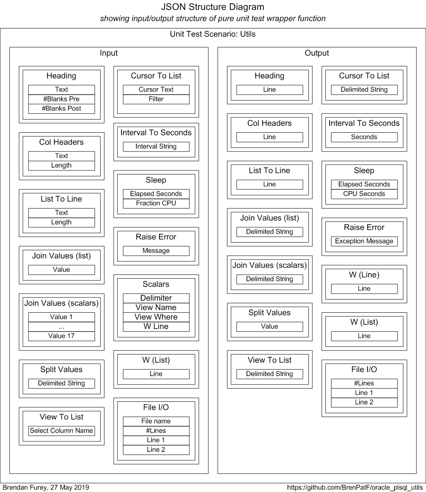

# Utils

Oracle PL/SQL general utilities module.

:hammer_and_wrench:

This module comprises a set of generic user-defined Oracle types and a PL/SQL package of functions and procedures of general utility. It includes functions and procedures for:
- 'pretty-printing'
- returning records from cursors or views/tables as lists of delimited strings
- joining lists of values into delimited strings, and the converse splitting operation

This module is a pre-requisite for these other Oracle GitHub modules:
- [Trapit - Oracle PL/SQL unit testing module](https://github.com/BrenPatF/trapit_oracle_tester)
- [Log_Set - Oracle logging module](https://github.com/BrenPatF/log_set_oracle)
- [Timer_Set - Oracle PL/SQL code timing module](https://github.com/BrenPatF/timer_set_oracle)

The package is tested using the Math Function Unit Testing design pattern, with test results in HTML and text format included. See test_output\utils.html for the unit test results root page.

## In this README...
- [Usage (extract from main_col_group.sql)](https://github.com/BrenPatF/sandbox#usage-extract-from-main_col_groupsql)
- [API - Utils](https://github.com/BrenPatF/sandbox#api---utils)
- [Installation](https://github.com/BrenPatF/sandbox#installation)
- [Unit Testing](https://github.com/BrenPatF/sandbox#unit-testing)
- [Operating System/Oracle Versions](https://github.com/BrenPatF/sandbox#operating-systemoracle-versions)

## Usage (extract from main_col_group.sql)
- [In this README...](https://github.com/BrenPatF/sandbox#in-this-readme)
```sql
DECLARE
  l_res_arr              chr_int_arr;
BEGIN

  Col_Group.Load_File(p_file   => 'fantasy_premier_league_player_stats.csv', 
                      p_delim  => ',', 
                      p_colnum => 7);
  l_res_arr := Col_Group.List_Asis;
  Utils.W(p_line_lis => Utils.Heading(p_head => 'As Is'));

  Utils.W(p_line_lis => Utils.Col_Headers(p_value_lis => chr_int_arr(chr_int_rec('Team', 30), 
                                                                     chr_int_rec('Apps', -5)
  )));

  FOR i IN 1..l_res_arr.COUNT LOOP
    Utils.W(p_line => Utils.List_To_Line(
                          p_value_lis => chr_int_arr(chr_int_rec(p_res_arr(i).chr_value, 30), 
                                                     chr_int_rec(p_res_arr(i).int_value, -5)
    )));
  END LOOP;

END;
```
The main_col_group.sql script gives examples of usage for all the functions and procedures in the Utils package. In the extract above, an example package, Col_Group, is called to read and process a CSV file, with calls to Utils procedures and functions to 'pretty-print' a listing at the end:
```
As Is
=====
Team                             Apps
------------------------------  -----
team_name_2                         1
Blackburn                          33
...
```
To run the example script in a slqplus session from app subfolder (after installation):

```
SQL> @main_col_group
```

There is also a separate [module](https://github.com/BrenPatF/oracle_plsql_api_demos) demonstrating instrumentation and logging, code timing and unit testing of Oracle PL/SQL APIs, which also uses this module.

## API - Utils
- [In this README...](https://github.com/BrenPatF/sandbox#in-this-readme)
- [Heading(p_head)](https://github.com/BrenPatF/sandbox#l_heading_lis-l1_chr_arr--utilsheadingp_head)
- [Utils.Col_Headers(p_value_lis)](https://github.com/BrenPatF/sandbox#l_headers_lis-l1_chr_arr--utilscol_headersp_value_lis)
- [List_To_Line(p_value_lis)](https://github.com/BrenPatF/sandbox#l_line-varchar24000--utilslist_to_linep_value_lis)
- [Join_Values(p_value_lis, optional parameters)](https://github.com/BrenPatF/sandbox#l_line-varchar24000--utilsjoin_valuesp_value_lis-optional-parameters)
- [Join_Values(p_value1, optional parameters)](https://github.com/BrenPatF/sandbox#l_line-varchar24000--utilsjoin_valuesp_value1-optional-parameters)
- [Split_Values(p_string, optional parameters)](https://github.com/BrenPatF/sandbox#l_value_lis-l1_chr_arr--utilssplit_valuesp_string-optional-parameters)
- [View_To_List(p_view_name, p_sel_value_lis, optional parameters)](https://github.com/BrenPatF/sandbox#l_row_lis-l1_chr_arr--utilsview_to_listp_view_name-p_sel_value_lis-optional-parameters)
- [Cursor_To_List(x_csr, optional parameters)](https://github.com/BrenPatF/sandbox#l_row_lis-l1_chr_arr--utilscursor_to_listx_csr-optional-parameters)
- [IntervalDS_To_Seconds(p_interval)](https://github.com/BrenPatF/sandbox#l_seconds-number--utilsintervalds_to_secondsp_interval)
- [Sleep(p_ela_seconds, optional parameters)](https://github.com/BrenPatF/sandbox#utilssleepp_ela_seconds-optional-parameters)
- [Raise_Error(p_message)](https://github.com/BrenPatF/sandbox#utilsraise_errorp_message)
- [W(p_line)](https://github.com/BrenPatF/sandbox#utilswp_line)
- [W(p_line_lis)](https://github.com/BrenPatF/sandbox#utilswp_line_lis)

This package runs with Invoker rights, not the default Definer rights, so that the dynamic SQL methods execute SQL using the rights of the calling schema, not the lib schema (if different).

### l_heading_lis L1_chr_arr := Utils.Heading(p_head)
Returns a 2-element string array consisting of the string passed in and a string of underlining '=' of the same length, with parameters as follows:

* `p_head`: string to be used as a heading

### l_headers_lis L1_chr_arr := Utils.Col_Headers(p_value_lis)
Returns a 2-element string array consisting of a string containing the column headers passed in, justified as specified, and a string of sets of underlining '-' of the same lengths as the justified column headers, with parameters as follows:

* `p_value_lis`: chr_int_arr type, array of objects of type chr_int_rec:
  * `chr_value`: column header text
  * `int_value`: field size for the column header, right-justify if < 0, else left-justify

### l_line VARCHAR2(4000) := Utils.List_To_Line(p_value_lis)
- [API - Utils](https://github.com/BrenPatF/sandbox#api---utils)

Returns a string containing the values passed in as a list of tuples, justified as specified in the second element of the tuple, with parameters as follows:
* `p_value_lis`: chr_int_arr type, array of objects of type chr_int_rec:
  * `chr_value`: value text
  * `int_value`: field size for the value, right-justify if < 0, else left-justify

### l_line VARCHAR2(4000) := Utils.Join_Values(p_value_lis, `optional parameters`)
Returns a string containing the values passed in as a list of strings, delimited by the optional p_delim parameter that defaults to '|', with parameters as follows:
* `p_value_lis`: list of strings

Optional parameters:
* `p_delim`: delimiter string, defaults to '|'

### l_line VARCHAR2(4000) := Utils.Join_Values(p_value1, `optional parameters`)
- [API - Utils](https://github.com/BrenPatF/sandbox#api---utils)

Returns a string containing the values passed in as distinct parameters, delimited by the optional p_delim parameter that defaults to '|', with parameters as follows:
* `p_value1`: mandatory first value

Optional parameters:
* `p_value2-p_value17`: 16 optional values, defaulting to the constant PRMS_END. The first defaulted value encountered acts as a list terminator
* `p_delim`: delimiter string, defaults to '|'

### l_value_lis L1_chr_arr := Utils.Split_Values(p_string, `optional parameters`)
Returns a list of string values obtained by splitting the input string on a given delimiter, with parameters as follows:

* `p_string`: string to split

Optional parameters:
* `p_delim`: delimiter string, defaults to '|'

### l_row_lis L1_chr_arr := Utils.View_To_List(p_view_name, p_sel_value_lis, `optional parameters`)
Returns a list of rows returned from the specified view/table, with specified column list and where clause, delimiting values with specified delimiter, with parameters as follows:

* `p_view_name`: name of table or view
* `p_sel_value_lis`: L1_chr_arr list of columns to select

Optional parameters:
* `p_where`: where clause, omitting WHERE key-word
* `p_delim`: delimiter string, defaults to '|'

### l_row_lis L1_chr_arr := Utils.Cursor_To_List(x_csr, `optional parameters`)
- [API - Utils](https://github.com/BrenPatF/sandbox#api---utils)

Returns a list of rows returned from the ref cursor passed, delimiting values with specified delimiter, with filter clause applied via RegExp_Like to the delimited rows, with parameters as follows:

* `x_csr`: IN OUT SYS_REFCURSOR, passed as open, and closed in function after processing

Optional parameters:
* `p_filter`: filter clause, regex expression passed to RegExp_Like against output line
* `p_delim`: delimiter string, defaults to '|'

### l_seconds NUMBER := Utils.IntervalDS_To_Seconds(p_interval)
Returns the number of seconds in a day-to-second interval, with parameters as follows:

* `p_interval`: INTERVAL DAY TO SECOND

### Utils.Sleep(p_ela_seconds, `optional parameters`)
- [API - Utils](https://github.com/BrenPatF/sandbox#api---utils)

Sleeps for a given number of seconds elapsed time, including a given proportion of CPU time, with both numbers approximate, with parameters as follows:

* `p_ela_seconds`: elapsed time to sleep

Optional parameters
* `p_fraction_CPU`: fraction of elapsed time to use CPU, default 0.5

### Utils.Raise_Error(p_message)
Raises an error using Raise_Application_Error with fixed error number of 20000, with parameters as follows:

* `p_message`: error message

### Utils.W(p_line)
Writes a line of text using DBMS_Output.Put_line, with parameters as follows:

* `p_line`: line of text to write

### Utils.W(p_line_lis)
- [API - Utils](https://github.com/BrenPatF/sandbox#api---utils)

Writes a list of lines of text using DBMS_Output.Put_line, with parameters as follows:

* `p_line_lis`: L1_chr_arr list of lines of text to write

## Installation
- [In this README...](https://github.com/BrenPatF/sandbox#in-this-readme)
- [Install 1: Create lib and app schemas and Oracle directory (optional)](https://github.com/BrenPatF/sandbox#install-1-create-lib-and-app-schemas-and-oracle-directory-optional)
- [Install 2: Create Utils components](https://github.com/BrenPatF/sandbox#install-2-create-utils-components)
- [Install 3: Create components for example code](https://github.com/BrenPatF/sandbox#install-3-create-components-for-example-code)
- [Install 4: Install Trapit module](https://github.com/BrenPatF/sandbox#install-4-install-trapit-module)
- [Install 5: Install unit test code](https://github.com/BrenPatF/sandbox#install-5-install-unit-test-code)

You can install just the base module in an existing schema, or alternatively, install base module plus an example of usage, and unit testing code, in two new schemas, `lib` and `app`.

### Install 1: Create lib and app schemas and Oracle directory (optional)
- [Installation](https://github.com/BrenPatF/sandbox#installation)
#### [Schema: sys; Folder: (module root)]
- install_sys.sql creates an Oracle directory, `input_dir`, pointing to 'c:\input'. Update this if necessary to a folder on the database server with read/write access for the Oracle OS user
- Run script from slqplus:
```
SQL> @install_sys
```

If you do not create new users, subsequent installs will be from whichever schemas are used instead of lib and app.

### Install 2: Create Utils components
- [Installation](https://github.com/BrenPatF/sandbox#installation)
#### [Schema: lib; Folder: lib]
- Run script from slqplus:
```
SQL> @install_utils app
```

This creates the required components for the base install along with grants for them to the app schema (passing none instead of app will bypass the grants). This install is all that is required to use the package and object types within the lib schema and app (if passed). To grant privileges to any `schema`, run the grants script directly, passing `schema`:
```
SQL> @grant_utils_to_app schema
```

### Install 3: Create components for example code
- [Installation](https://github.com/BrenPatF/sandbox#installation)
#### [Folder: (module root)] Copy example csv to input folder
- Copy the following file from the root folder to the server folder pointed to by the Oracle directory INPUT_DIR:
    - fantasy_premier_league_player_stats.csv

- There is also a bash script to do this (it also copies the unit test JSON file), assuming C:\input as INPUT_DIR:
```
$ ./cp_data_files_to_input.ksh
```

#### [Schema: app; Folder: app] Install example code
- Run script from slqplus:
```
SQL> @install_col_group lib
```

You can review the results from the example code in the `app` subfolder without doing this install. This install creates private synonyms to the lib schema. To create synonyms within another schema, run the synonyms script directly from that schema, passing lib schema:
```
SQL> @c_utils_syns lib
```

The remaining, optional, installs are for the unit testing code, and require a minimum Oracle database version of 12.2.

### Install 4: Install Trapit module
- [Installation](https://github.com/BrenPatF/sandbox#installation)

The module can be installed from its own Github page: [Trapit on GitHub](https://github.com/BrenPatF/trapit_oracle_tester). Alternatively, it can be installed directly here as follows:

#### [Schema: lib; Folder: install_ut_prereq\lib] Create lib components
- Run script from slqplus:
```
SQL> @install_lib_all
```
#### [Schema: app; Folder: install_ut_prereq\app] Create app synonyms
- Run script from slqplus:
```
SQL> @c_syns_all
```
#### [Folder: (npm root)] Install npm trapit package
The npm trapit package is a nodejs package used to format unit test results as HTML pages.

Open a DOS or Powershell window in the folder where you want to install npm packages, and, with [nodejs](https://nodejs.org/en/download/) installed, run
```
$ npm install trapit
```
This should install the trapit nodejs package in a subfolder .\node_modules\trapit

### Install 5: Install unit test code
- [Installation](https://github.com/BrenPatF/sandbox#installation)

This step requires the Trapit module option to have been installed via Install 4 above.

#### [Folder: (module root)] Copy unit test JSON file to input folder
- Copy the following file from the root folder to the server folder pointed to by the Oracle directory INPUT_DIR:
    - tt_utils.test_api_inp.json

- The bash script mentioned in Install 3 above also copies this file, assuming C:\input as INPUT_DIR (so if executed already, no need to repeat):
```
$ ./cp_data_files_to_input.ksh
```

#### [Schema: lib; Folder: lib] Install unit test code
- Run script from slqplus:
```
SQL> @install_utils_tt
```

## Unit Testing
- [In this README...](https://github.com/BrenPatF/sandbox#in-this-readme)
- [Wrapper Function Diagram](https://github.com/BrenPatF/sandbox#wrapper-function-diagram)
- [Unit Test Summary Page](https://github.com/BrenPatF/sandbox#unit-test-summary-page)

The unit test program (if installed) may be run from the Oracle lib subfolder:

```
SQL> @r_tests
```

The program is data-driven from the input file tt_utils.test_api_inp.json and produces an output file, tt_utils.test_api_out.json, that contains arrays of expected and actual records by group and scenario.

The output file is processed by a nodejs program that has to be installed separately from the `npm` nodejs repository, as described in the Trapit install in `Install 4` above. The nodejs program produces listings of the results in HTML and/or text format, and a sample set of listings is included in the subfolder test_output. To run the processor (in Windows), open a DOS or Powershell window in the trapit package folder after placing the output JSON file, tt_utils.test_api_out.json, in the subfolder ./examples/externals and run:

```
$ node ./examples/externals/test-externals
```

The three testing steps can easily be automated in Powershell (or Unix bash).

The package is tested using the Math Function Unit Testing design pattern (`See also - Trapit` below). In this approach, a 'pure' wrapper function is constructed that takes input parameters and returns a value, and is tested within a loop over scenario records read from a JSON file.

In this case, where we have a set of small independent methods, most of which are pure functions, the wrapper function is designed to test all of them in a single generalised transaction. Four high level scenarios were identified (`Small`, `Large`, `Many`, `Bad SQL`).

### Wrapper Function Diagram
- [Unit Testing](https://github.com/BrenPatF/sandbox#unit-testing)

This diagram shows the input/output structure of the pure unit test wrapper function:


### Unit Test Summary Page
- [Unit Testing](https://github.com/BrenPatF/sandbox#unit-testing)

This is an image of the unit test summary page, and it shows the scenarios tested.


You can review the formatted unit test results obtained by the author here, [Unit Test Report: utils](http://htmlpreview.github.io/?https://github.com/BrenPatF/sandbox/blob/master/test_output/utils.html), and the files are available in the `test_output` subfolder [utils.html is the root page for the HTML version and utils.txt has the results in text format].

## Operating System/Oracle Versions
- [In this README...](https://github.com/BrenPatF/sandbox#in-this-readme)
### Windows
Tested on Windows 10, should be OS-independent
### Oracle
- Tested on Oracle Database Version 18.3.0.0.0
- Base code (and example) should work on earlier versions at least as far back as v11

## See also
- [Trapit - Oracle PL/SQL unit testing module](https://github.com/BrenPatF/trapit_oracle_tester)
- [Log_Set - Oracle logging module](https://github.com/BrenPatF/log_set_oracle)
- [Timer_Set - Oracle PL/SQL code timing module](https://github.com/BrenPatF/timer_set_oracle)
- [Trapit - nodejs unit test processing package](https://github.com/BrenPatF/trapit_nodejs_tester)
- [Oracle PL/SQL API Demos - demonstrating instrumentation and logging, code timing and unit testing of Oracle PL/SQL APIs](https://github.com/BrenPatF/oracle_plsql_api_demos)

## License
MIT