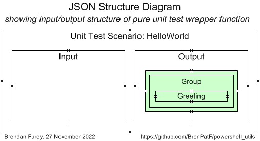
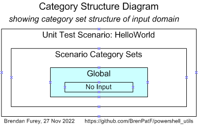
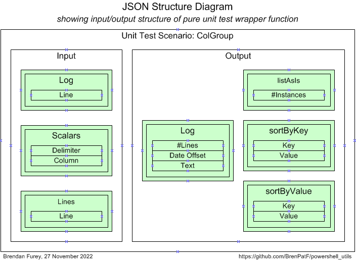
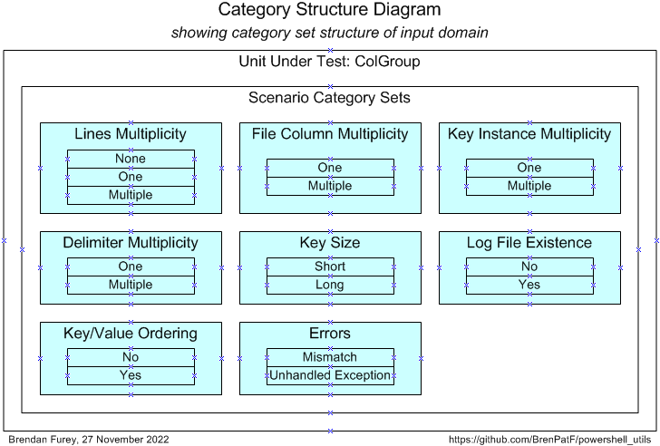
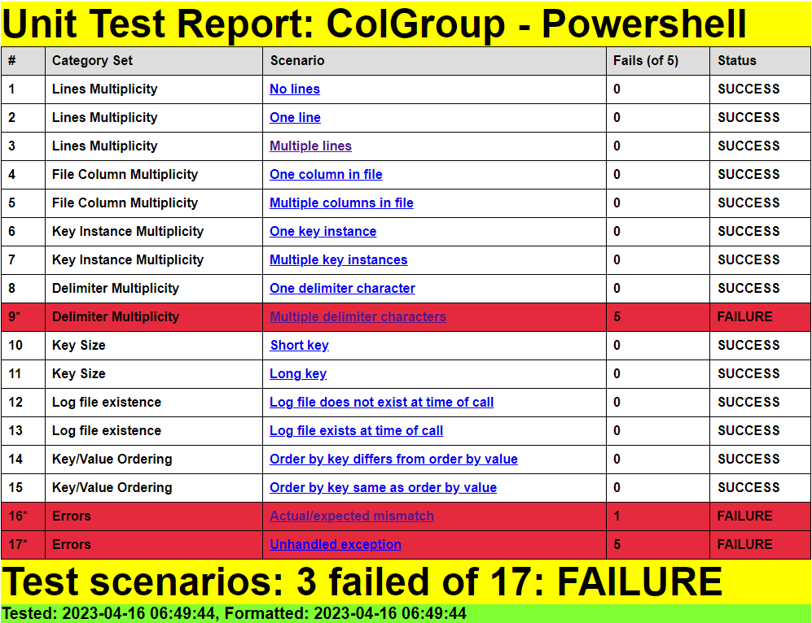
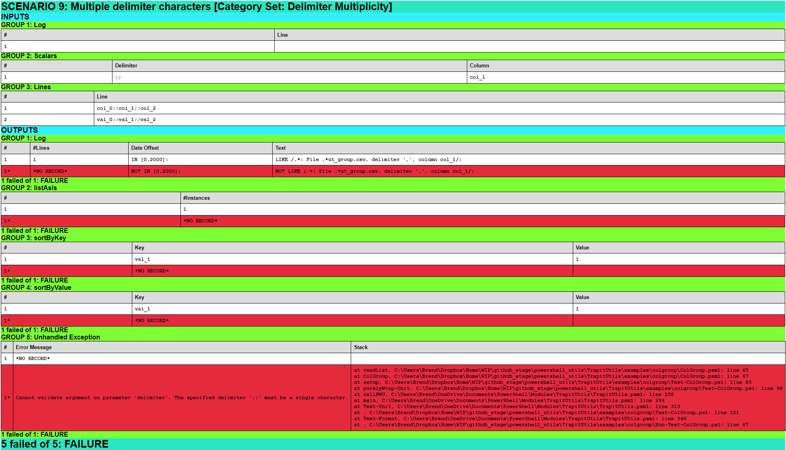
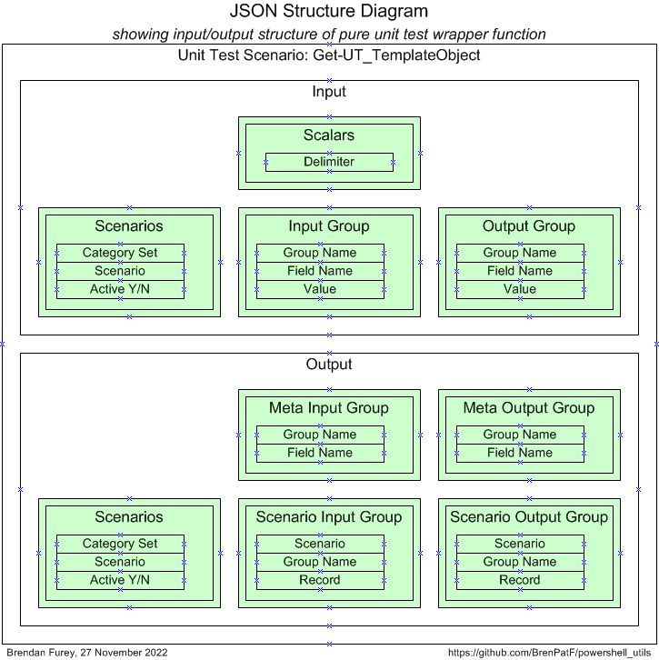
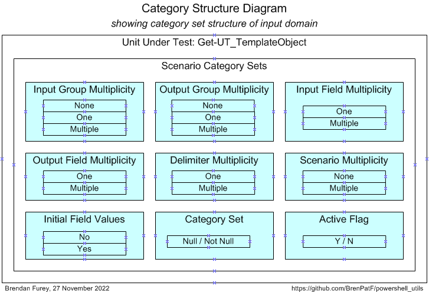
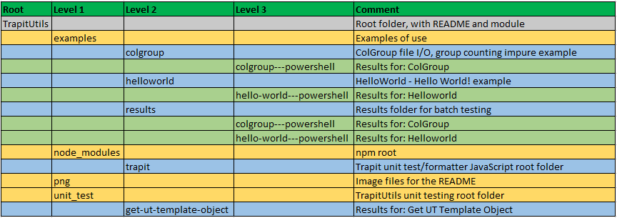

# powershell_utils/TrapitUtils


> Powershell Trapit Unit Testing Utilities module

:hammer_and_wrench: :detective:

This module contains two powershell utility functions for unit testing following the Math Function Unit Testing design pattern. The first one supports the design pattern for testing in any language:

- `Write-UT_Template` creates a template for the JSON input file required by the design pattern, based on CSV files specifying the structure. The template file includes scenarios that may be assigned against category sets, with placeholder records to be updated manually

The second is for testing powershell programs:

- `Test-Unit` is the powershell version of the unit testing driver program required by the design pattern, using JSON files for input scenarios and output results

Within this design pattern, unit test results are formatted by a JavaScript program that takes the JSON output results file as its input: [Trapit - JavaScript Unit Tester/Formatter](https://github.com/BrenPatF/trapit_nodejs_tester).

This blog post, [Unit Testing, Scenarios and Categories: The SCAN Method](https://brenpatf.github.io/jekyll/update/2021/10/17/unit-testing-scenarios-and-categories-the-scan-method.html) provides guidance on effective  selection of scenarios for unit testing.

There is an extended Usage section below that illustrates the use of the powershell utilities, along with the JavaScript program, for unit testing, by means of two examples. The Unit Testing section also uses them in testing the pure function, Get-UT_TemplateObject, which is called by Write-UT_Template.

# In This README...
[&darr; Background](#background)<br />
[&darr; Usage](#usage)<br />
[&darr; API - TrapitUtils](#api---trapitutils)<br />
[&darr; Installation](#installation)<br />
[&darr; Unit Testing](#unit-testing)<br />
[&darr; Folder Structure](#folder-structure)<br />
[&darr; See Also](#see-also)<br />

## Background
[&uarr; In This README...](#in-this-readme)<br />

I explained the concepts for the unit testing design pattern in relation specifically to database testing in a presentation at the Oracle User Group Ireland Conference in March 2018:

- [The Database API Viewed As A Mathematical Function: Insights into Testing](https://www.slideshare.net/brendanfurey7/database-api-viewed-as-a-mathematical-function-insights-into-testing)

I later named the approach 'The Math Function Unit Testing design pattern' when I applied it in Javascript and wrote a JavaScript program to format results both in plain text and as HTML pages:
- [Trapit - JavaScript Unit Tester/Formatter](https://github.com/BrenPatF/trapit_nodejs_tester)

The module also allowed for the formatting of results obtained from testing in languages other than JavaScript by means of an intermediate output JSON file. In 2021 I developed a powershell module that included a utility to generate a template for the JSON input scenarios file required by the design pattern:
- [Powershell Trapit Unit Testing Utilities module.](https://github.com/BrenPatF/powershell_utils/tree/master/TrapitUtils)

Also in 2021 I developed a systematic approach to the selection of unit test scenarios:
- [Unit Testing, Scenarios and Categories: The SCAN Method](https://brenpatf.github.io/jekyll/update/2021/10/17/unit-testing-scenarios-and-categories-the-scan-method.html)

In early 2023 I extended both the the JavaScript results formatter, and the powershell utility to incorporate Category Set as a scenario attribute. Both utilities support use of the design pattern in any language, while the unit testing driver utility is language-specific and is currently available in Powershell, JavaScript, Python and Oracle PL/SQL versions.
## Usage
[&uarr; In This README...](#in-this-readme)<br />
[&darr; General Usage](#general-usage)<br />
[&darr; Examples](#examples)<br />

As noted above, the JavaScript module allows for unit testing of JavaScript programs and also the formatting of test results for both JavaScript and non-JavaScript programs. Similarly, the powershell module mentioned allows for unit testing of powershell programs, and also the generation of the JSON input scenarios file template for testing in any language.

In this section we'll start by describing the steps involved in The Math Function Unit Testing design pattern at an overview level. This will show how the generic powershell and JavaScript utilities fit in alongside the language-specific driver utilities.

Then we'll show how to use the design pattern in unit testing powershell programs by means of two simple examples.

### General Usage
[&uarr; Usage](#usage)<br />
[&darr; Step 1: Create JSON File](#step-1-create-json-file)<br />
[&darr; Step 2: Create Results Object](#step-2-create-results-object)<br />
[&darr; Step 3: Format Results](#step-3-format-results)<br />
[&darr; Batch Testing](#batch-testing)<br />

At a high level the Math Function Unit Testing design pattern involves three main steps:

1. Create an input file containing all test scenarios with input data and expected output data for each scenario
2. Create a results object based on the input file, but with actual outputs merged in, based on calls to the unit under test
3. Use the results object to generate unit test results files formatted in HTML and/or text


The first and third of these steps are supported by generic utilities that can be used in unit testing in any language. The second step uses a language-specific unit test driver utility.

For non-JavaScript programs the results object is materialized using a library package in the relevant language. The diagram below shows how the processing from the input JSON file splits into two distinct steps:
- First, the output results object is created using the external library package which is then written to a JSON file
- Second, a script from the Trapit JavaScript library package is run, passing in the name of the output results JSON file

This creates a subfolder with name based on the unit test title within the file, and also outputs a summary of the results. The processing is split between three code units:
- Test Unit: External library function that drives the unit testing with a callback to a specific wrapper function
- Specific Test Package: This has a 1-line main program to call the library driver function, passing in the callback wrapper function
- Unit Under Test: Called by the wrapper function, which converts between its specific inputs and outputs and the generic version used by the library package


In the first step the external program creates the output results JSON file, while in the second step the file is read into an object by the Trapit library package, which then formats the results.

#### Step 1: Create JSON File
[&uarr; General Usage](#general-usage)<br />

Step 1 requires analysis to determine the extended signature for the unit under test, and to determine appropriate scenarios to test.

The art of unit testing lies in choosing a set of scenarios that will produce a high degree of confidence in the functioning of the unit under test across the often very large range of possible inputs.

A useful approach to this can be to think in terms of categories of inputs, where we reduce large ranges to representative categories. I explore this approach further in this article:

- [Unit Testing, Scenarios and Categories: The SCAN Method](https://brenpatf.github.io/jekyll/update/2021/10/17/unit-testing-scenarios-and-categories-the-scan-method.html)

While the examples in the blog post aimed at minimal sets of scenarios, we have since found it simpler and clearer to use a separate scenario for each category.

The results of this analysis can be summarised in three CSV files which the first API in this powershell package uses as inputs to create a template for the JSON file.

The powershell API, `Write-UT_Template` creates a template for the JSON file, with the full meta section, and a set of template scenarios having name as scenario key, a category set attribute, and a single record with default values for each input and output group. The API takes as inputs three CSV files:
  - `stem`_inp.csv: Input group triplets - (Input group name, field name, default value)
  - `stem`_out.csv: Input group triplets - (Output group name, field name, default value)
  - `stem`_sce.csv: Scenario triplets - (Category set, scenario name, active flag)


It may be useful during the analysis phase to create two diagrams, one for the extended signature:
- JSON Structure Diagram: showing the groups with their fields for input and output

and another for the category sets and categories:
- Category Structure Diagram: showing the category sets identified with their categories

You can see examples of these diagrams later in this document, eg: [JSON Structure Diagram - ColGroup](#unit-test-wrapper-function---colgroup) and [Category Structure Diagram - ColGroup](#scenario-category-analysis-scan---colgroup).


The API can be run with the following powershell in the folder of the CSV files:

#### Format-JSON-Stem.ps1
```powershell
Import-Module TrapitUtils
Write-UT_Template 'stem' '|'
```
This creates the template JSON file, `stem`_temp.json based on the CSV files having prefix `stem` and using the field delimiter '|'. The template file is then updated manually with data appropriate to each scenario.

This powershell API can be used for testing in any language.

#### Step 2: Create Results Object
[&uarr; General Usage](#general-usage)<br />

Step 2 requires the writing of a wrapper function that is passed into a call to the second API.

- `Test-Unit` is the library unit test driver function that reads the input JSON file, calls the wrapper function for each scenario, and writes the output JSON file with the actual results merged in along with the expected results

It takes the names of the input and output JSON files, plus the wrapper function name, as parameters.

##### Test-Stem.ps1 (skeleton)
```powershell
Import-Module TrapitUtils
function purelyWrap-Unit($inpGroups) { # input scenario groups
(function body)
}
Test-Unit ($PSScriptRoot + '/stem.json') ($PSScriptRoot + '/stem_out.json') ${function:purelyWrap-Unit}
```
This creates the output JSON file: `stem`_out.json. Generally it will be preferable not to call the script directly, but to include the call in a higher level script that calls it and also calls the JavaScript formatter, as in the next section.

The test driver API for step 2 is language-specific, and this one is for testing powershell programs. Equivalents exist under the same GitHub account (BrenPatF) for JavaScript, Python and Oracle PL/SQL at present.

#### Step 3: Format Results
[&uarr; General Usage](#general-usage)<br />

Step 3 involves formatting the results contained in the JSON output file from step 2, via the JavaScript formatter, and this step can be combined with step 2 for convenience.

- `Test-Format` is the library function that calls the main test driver function, then passes the output JSON file name to the JavaScript formatter and outputs a summary of the results

It takes the name of the test driver script and the JavaScript root location as parameters.

##### Run-Test-Stem.ps1
```powershell
Import-Module TrapitUtils
Test-Format ($PSScriptRoot + '/Test-Stem.ps1') ($PSScriptRoot + '/../..')
```
This script creates a results subfolder, with results in text and HTML formats, in the script folder, and outputs a summary of the following form:

```
Results summary for file: [MY_PATH]/stem_out.json
==============================================

File:          stem_out.json
Title:         [Title]
Inp Groups:    [Inp Groups]
Out Groups:    [Out Groups]
Tests:         [Tests]
Fails:         [Fails]
Folder:        [Folder]
```
#### Batch Testing
[&uarr; General Usage](#general-usage)<br />

If we want to test and format the results for a batch of units at once, we can use another API function to do that:

- `Test-FormatFolder` is the library function that calls each of a list of powershell unit test driver scripts, then calls the JavaScript formatter, which writes the formatted results files to a subfolder within a results folder, based on the titles, returning a summary of the results

It takes as parameters: an array of full names of the unit test driver scripts; the folder where JSON files are copied, and results subfolders placed; the parent folder of the JavaScript node_modules npm root folder.

##### Run-Test-Batch.ps1 (template)
```powershell
Import-Module TrapitUtils
[Define $psScriptLis, $jsonFolder, $npmRoot variables]
Test-FormatFolder $psScriptLis $jsonFolder $npmRoot
```
This script creates results subfolders within the JSON files folder for each unit, and outputs a summary of the following form:

```
Unit Test Results Summary for Folder [Folder]
=============================================
 File                 Title                     Inp Groups  Out Groups  Tests  Fails  Folder
--------------------  ------------------------  ----------  ----------  -----  -----  ------------------------
...
[Failed] externals failed, see [MY_PATH]/results for scenario listings
...
```

### Examples
[&uarr; Usage](#usage)<br />
[&darr; Example 1 - HelloWorld](#example-1---helloworld)<br />
[&darr; Example 2 - ColGroup](#example-2---colgroup)<br />
[&darr; Batch Testing](#batch-testing-1)<br />

This section illustrates the usage of the package by means of two examples. The first is a version of the 'Hello World' program traditionally used as a starting point in learning a new programming language. This is useful as it shows the core structures involved in following the design pattern with a minimalist unit under test.

The second example, 'ColGroup', is larger and intended to show a wider range of features, but without too much extraneous detail.

As noted in the general section above the formatting of results in step 3 is done by a JavaScript program that processes the JSON files.
#### Example 1 - HelloWorld
[&uarr; Examples](#examples)<br />
[&darr; Step 1: Create JSON File - HelloWorld](#step-1-create-json-file---helloworld)<br />
[&darr; Step 2: Create Results Object - HelloWorld](#step-2-create-results-object---helloworld)<br />
[&darr; Step 3: Format Results - HelloWorld](#step-3-format-results---helloworld)<br />

This is a pure function form of Hello World program, returning a value rather than writing to screen itself. It is of course trivial, but has some interest as an edge case with no inputs and extremely simple JSON input structure and test code.
##### HelloWorld.psm1
```powershell
function Write-HelloWorld {
    'Hello World!'
}
```
There is a main script that shows how the function might be called outside of unit testing, run from the examples folder:
##### Show-HelloWorld.ps1
```powershell
Using Module './HelloWorld.psm1'
Write-HelloWorld
```
This can be called from a command window in the examples folder:
```powershell
$ ./helloworld/Show-HelloWorld
```
with output to console:
```
Hello World!
```

##### Step 1: Create JSON File - HelloWorld
[&uarr; Example 1 - HelloWorld](#example-1---helloworld)<br />
[&darr; Unit Test Wrapper Function - HelloWorld](#unit-test-wrapper-function---helloworld)<br />
[&darr; Scenario Category ANalysis (SCAN) - HelloWorld](#scenario-category-analysis-scan---helloworld)<br />

###### Unit Test Wrapper Function - HelloWorld
[&uarr; Step 1: Create JSON File - HelloWorld](#step-1-create-json-file---helloworld)<br />

Here is a diagram of the input and output groups for this example:



From the input and output groups depicted we can construct CSV files with flattened group/field structures, and default values added, as follows (with `helloworld_inp.csv` left, `helloworld_out.csv` right):


###### Scenario Category ANalysis (SCAN) - HelloWorld
[&uarr; Step 1: Create JSON File - HelloWorld](#step-1-create-json-file---helloworld)<br />

The Category Structure diagram for the HelloWorld example is of course trivial:



It has just one scenario, with its input being void:

|  # | Category Set | Category | Scenario |
|---:|:-------------|:---------|:---------|
|  1 | Global       | No input | No input |

From the scenarios identified we can construct the following CSV file (`helloworld_sce.csv`), taking the category set and scenario columns, and adding an initial value for the active flag:


The API can be run with the following powershell in the folder of the CSV files:

###### Format-JSON-HelloWorld.ps1
```powershell
Import-Module TrapitUtils
Write-UT_Template 'helloworld' '|'
```
This creates the template JSON file, helloworld_temp.json, which contains an element for each of the scenarios, with the appropriate category set and active flag, with a single record in each group with default values from the groups CSV files. Here is the complete file:
```js
{
  "meta": {
    "title": "title",
    "delimiter": "|",
    "inp": {},
    "out": {
      "Group": [
        "Greeting"
      ]
    }
  },
  "scenarios": {
    "No input": {
      "active_yn": "Y",
      "category_set": "Global",
      "inp": {},
      "out": {
        "Group": [
          "Hello World!"
        ]
      }
    }
  }
}
```
The actual JSON file has just the "title" value replaced with: "HelloWorld - Powershell".

##### Step 2: Create Results Object - HelloWorld
[&uarr; Example 1 - HelloWorld](#example-1---helloworld)<br />

Step 2 requires the writing of a wrapper function that is passed into a call to the Test-Unit API.

- `Test-Unit` is the unit test driver function from the TrapitUtils package that reads the input JSON file, calls the wrapper function for each scenario, and writes the output JSON file with the actual results merged in along with the expected results

It takes the names of the input and output JSON files, plus the wrapper function name, as parameters.

Here is the complete script for this case, where we use a Lambda expression as the wrapper function is so simple:

###### Test-HelloWorld.ps1
```powershell
Using Module './HelloWorld.psm1'
Import-Module TrapitUtils
Test-Unit ($PSScriptRoot + '/helloworld.json') ($PSScriptRoot + '/helloworld_out.json') `
          { param($inpGroups) [PSCustomObject]@{'Group' = [String[]]@(Write-HelloWorld)} }
```

This creates the output JSON file: helloworld_out.json. Generally it will be preferable not to call the script directly, but to include the call in a higher level script that calls it and also calls the JavaScript formatter, as in the next section.

##### Step 3: Format Results - HelloWorld
[&uarr; Example 1 - HelloWorld](#example-1---helloworld)<br />
[&darr; Unit Test Report - HelloWorld](#unit-test-report---helloworld)<br />
[&darr; Scenario 1: No input](#scenario-1-no-input)<br />

Step 3 involves formatting the results contained in the JSON output file from step 2, via the JavaScript formatter, and this step can be combined with step 2 for convenience.

- `Test-Format` is the function from the TrapitUtils package that calls the main test driver function, then passes the output JSON file name to the JavaScript formatter and outputs a summary of the results

It takes the name of the test driver script and the JavaScript root location as parameters.

###### Run-Test-HelloWorld.ps1
```powershell
Import-Module TrapitUtils
Test-Format ($PSScriptRoot + '/Test-HelloWorld.ps1') ($PSScriptRoot + '/../..')
```
This script creates a results subfolder, with results in text and HTML formats, in the script folder, and outputs the following summary:

```
Results summary for file: [MY_PATH]/powershell_utils/TrapitUtils/examples/helloworld/helloworld_out.json
=============================================================================================================

File:          helloworld_out.json
Title:         Hello World - Powershell
Inp Groups:    0
Out Groups:    2
Tests:         1
Fails:         0
Folder:        hello-world---powershell
```

Here we show the scenario-level summary of results for this example, and also show the detail for the only scenario.

You can review the HTML formatted unit test results here:

- [Unit Test Report: Hello World](http://htmlpreview.github.io/?https://github.com/BrenPatF/powershell_utils/blob/master/TrapitUtils/examples/helloworld/hello-world---powershell/hello-world---powershell.html)

###### Unit Test Report - HelloWorld
[&uarr; Step 3: Format Results - HelloWorld](#step-3-format-results---helloworld)<br />

This is the summary page in text format.

```
Unit Test Report: Hello World - Powershell
==========================================

      #    Category Set  Scenario  Fails (of 2)  Status
      ---  ------------  --------  ------------  -------
      1    Global        No input  0             SUCCESS

Test scenarios: 0 failed of 1: SUCCESS
======================================
Tested: 2023-04-09 14:43:33, Formatted: 2023-04-09 14:43:33
```

###### Scenario 1: No input
[&uarr; Step 3: Format Results - HelloWorld](#step-3-format-results---helloworld)<br />

This is the scenario page in text format, with only one scenario.

```
SCENARIO 1: No input [Category Set: Global] {
=============================================
   INPUTS
   ======
   OUTPUTS
   =======
      GROUP 1: Group {
      ================
            #  Greeting
            -  ------------
            1  Hello World!
      } 0 failed of 1: SUCCESS
      ========================
      GROUP 2: Unhandled Exception: Empty as expected: SUCCESS
      ========================================================
} 0 failed of 2: SUCCESS
========================
```
Note that the second output group, 'Unhandled Exception', is not specified in the CSV file: In fact, this is generated by the Test-Unit API itself in order to capture any unhandled exception.
#### Example 2 - ColGroup
[&uarr; Examples](#examples)<br />
[&darr; Step 1: Create JSON File - ColGroup](#step-1-create-json-file---colgroup)<br />
[&darr; Step 2: Create Results Object - ColGroup](#step-2-create-results-object---colgroup)<br />
[&darr; Step 3: Format Results - ColGroup](#step-3-format-results---colgroup)<br />

This example involves a class with a constructor function that reads in a CSV file and counts instances of distinct values in a given column. The constructor function appends a timestamp and call details to a log file. The class has methods to list the value/count pairs in several orderings.

##### ColGroup.psm1 (skeleton)
```powershell
...
Class ColGroup {
    ...
}
```

There is a main script that shows how the class might be called outside of unit testing, run from the examples folder:
##### Show-ColGroup.ps1
```powershell
Using Module './ColGroup.psm1'
$INPUT_FILE, $DELIM, $COL = ($PSScriptRoot + '/fantasy_premier_league_player_stats.csv'), ',', 'team_name'

$grp = [ColGroup]::New($INPUT_FILE, $DELIM, $COL)

$grp.WriteList('(as is)', $grp.ListAsIs())
$grp.WriteList('key',     $grp.SortByKey())
$grp.WriteList('value',   $grp.SortByValue())
```
This can be called from a command window in the examples folder:

```powershell
$ ./colgroup/Show-ColGroup
```
with output to console:

```
Counts sorted by (as is)
========================
Team         #apps
-----------  -----
Man City      1099
Southampton   1110
Stoke City    1170
...

Counts sorted by key
====================
Team         #apps
-----------  -----
Arsenal        534
Aston Villa    685
Blackburn       33
...
Counts sorted by value
======================
Team         #apps
-----------  -----
Wolves          31
Blackburn       33
Bolton          37
...
```
and to log file, fantasy_premier_league_player_stats.csv.log:
```
2023-04-10 08:02:43: File [MY_PATH]\TrapitUtils\examples\colgroup\fantasy_premier_league_player_stats.csv, delimiter ',', column team_name
```

The example illustrates how a wrapper function can handle `impure` features of the unit under test:
- Reading input from file
- Writing output to file

...and also how the JSON input file can allow for nondeterministic outputs giving rise to deterministic test outcomes:
- By using regex matching for strings including timestamps
- By using number range matching and converting timestamps to epochal offsets (number of units of time since a fixed time)

##### Step 1: Create JSON File - ColGroup
[&uarr; Example 2 - ColGroup](#example-2---colgroup)<br />
[&darr; Unit Test Wrapper Function - ColGroup](#unit-test-wrapper-function---colgroup)<br />
[&darr; Scenario Category ANalysis (SCAN) - ColGroup](#scenario-category-analysis-scan---colgroup)<br />

###### Unit Test Wrapper Function - ColGroup
[&uarr; Step 1: Create JSON File - ColGroup](#step-1-create-json-file---colgroup)<br />

Here is a diagram of the input and output groups for this example:



From the input and output groups depicted we can construct CSV files with flattened group/field structures, and default values added, as follows (with `colgrp_inp.csv` left, `colgrp_out.csv` right):


###### Scenario Category ANalysis (SCAN) - ColGroup
[&uarr; Step 1: Create JSON File - ColGroup](#step-1-create-json-file---colgroup)<br />

As noted earlier, a useful approach to scenario selection can be to think in terms of categories of inputs, where we reduce large ranges to representative categories.

###### Generic Category Sets - ColGroup

As explained in the article mentioned earlier, it can be very useful to think in terms of generic category sets that apply in many situations. Multiplicity is relevant here (as it often is):

###### Multiplicity

There are several entities where the generic category set of multiplicity applies, and we should check each of the None / One / Multiple instance categories.

| Code     | Description     |
|:--------:|:----------------|
| None     | No values       |
| One      | One value       |
| Multiple | Multiple values |

Apply to:
<ul>
<li>Lines</li>
<li>File Columns (one or multiple only)</li>
<li>Key Instance (one or multiple only)</li>
<li>Delimiter (one or multiple only)</li>
</ul>

###### Categories and Scenarios - ColGroup

After analysis of the possible scenarios in terms of categories and category sets, we can depict them on a Category Structure diagram:



We can tabulate the results of the category analysis, and assign a scenario against each category set/category with a unique description:

|  # | Category Set              | Category            | Scenario                                 |
|---:|:--------------------------|:--------------------|:-----------------------------------------|
|  1 | Lines Multiplicity        | None                | No lines                                 |
|  2 | Lines Multiplicity        | One                 | One line                                 |
|  3 | Lines Multiplicity        | Multiple            | Multiple lines                           |
|  4 | File Column Multiplicity  | One                 | One column in file                       |
|  5 | File Column Multiplicity  | Multiple            | Multiple columns in file                 |
|  6 | Key Instance Multiplicity | One                 | One key instance                         |
|  7 | Key Instance Multiplicity | Multiple            | Multiple key instances                   |
|  8 | Delimiter Multiplicity    | One                 | One delimiter character                  |
|  9 | Delimiter Multiplicity    | Multiple            | Multiple delimiter characters            |
| 10 | Key Size                  | Short               | Short key                                |
| 11 | Key Size                  | Long                | Long key                                 |
| 12 | Log file existence        | No                  | Log file does not exist at time of call  |
| 13 | Log file existence        | Yes                 | Log file exists at time of call          |
| 14 | Key/Value Ordering        | No                  | Order by key differs from order by value |
| 15 | Key/Value Ordering        | Yes                 | Order by key same as order by value      |
| 16 | Errors                    | Mismatch            | Actual/expected mismatch                 |
| 17 | Errors                    | Unhandled Exception | Unhandled Exception                      |

From the scenarios identified we can construct the following CSV file (`colgrp_sce.csv`), taking the category set and scenario columns, and adding an initial value for the active flag:


The API can be run with the following powershell script in the folder of the CSV files:

###### Format-JSON-ColGroup.ps1
```powershell
Import-Module TrapitUtils
Write-UT_Template 'colgroup' '|'
```
This creates the template JSON file, colgroup_temp.json, which contains an element for each of the scenarios, with the appropriate category set and active flag, with a single record in each group with default values from the groups CSV files. Here is the "Multiple lines" element:

    "Multiple lines": {
      "active_yn": "N",
      "category_set": "Lines Multiplicity",
      "inp": {
        "Log": [
          ""
        ],
        "Scalars": [
          ",|col_1"
        ],
        "Lines": [
          "col_0,col_1,col_2"
        ]
      },
      "out": {
        "Log": [
          "1|IN [0,2000]|LIKE /.*: File .*ut_group.*.csv, delimiter ',', column 0/"
        ],
        "listAsIs": [
          "1"
        ],
        "sortByKey": [
          "val_1|1"
        ],
        "sortByValue": [
          "val_1|1"
        ]
      }
    },

For each scenario element, we need to update the values to reflect the scenario to be tested, in the actual input JSON file, colgroup.json. In the case above, we can just replace the "Lines" input group with:

        "Lines": [
          "col_0,col_1,col_2",
          "val_0,val_1,val_2",
          "val_0,val_1,val_2"
        ]

and replace '1' with '2' in two of the output groups:

        "sortByKey": [
          "val_1|2"
        ],
        "sortByValue": [
          "val_1|2"
        ]

##### Step 2: Create Results Object - ColGroup
[&uarr; Example 2 - ColGroup](#example-2---colgroup)<br />

Step 2 requires the writing of a wrapper function that is passed into a call to the second API.

- `Test-Unit` is the unit test driver function from the TrapitUtils package that reads the input JSON file, calls the wrapper function for each scenario, and writes the output JSON file with the actual results merged in along with the expected results

It takes the names of the input and output JSON files, plus the wrapper function name, as parameters.

###### Test-ColGroup.ps1 (skeleton)
```powershell
Using Module './ColGroup.psm1'
Import-Module TrapitUtils
function purelyWrap-Unit($inpGroups) { # input scenario groups
(function body)
}
Test-Unit ($PSScriptRoot + '/colgroup.json') ($PSScriptRoot + '/colgroup_out.json') `
          ${function:purelyWrap-Unit}
```
This creates the output JSON file: colgroup_out.json. Generally it will be preferable not to call the script directly, but to include the call in a higher level script that calls it and also calls the JavaScript formatter, as in the next section.

##### Step 3: Format Results - ColGroup
[&uarr; Example 2 - ColGroup](#example-2---colgroup)<br />
[&darr; Unit Test Report - ColGroup](#unit-test-report---colgroup)<br />
[&darr; Scenario 9: Multiple delimiter characters](#scenario-9-multiple-delimiter-characters)<br />

Step 3 involves formatting the results contained in the JSON output file from step 2, via the JavaScript formatter, and this step can be combined with step 2 for convenience.

- `Test-Format` is the function from the TrapitUtils package that calls the main test driver function, then passes the output JSON file name to the JavaScript formatter and outputs a summary of the results.

It takes the name of the test driver script and the JavaScript root location as parameters.

###### Run-Test-ColGroup.ps1
```powershell
Import-Module TrapitUtils
Test-Format ($PSScriptRoot + '/Test-ColGroup.ps1') ($PSScriptRoot + '/../..')
```
This script creates a results subfolder, with results in text and HTML formats, in the script folder, and outputs the following summary:

```
Results summary for file: [MY_PATH]/powershell_utils/TrapitUtils/examples/colgroup/colgroup_out.json
=========================================================================================================

File:          colgroup_out.json
Title:         ColGroup - Powershell
Inp Groups:    3
Out Groups:    5
Tests:         17
Fails:         3
Folder:        colgroup---powershell
```

Here we show the scenario-level summary of results for the specific example, and show the detail for one of the failing scenarios.

You can review the HTML formatted unit test results here:

- [Unit Test Report: ColGroup](http://htmlpreview.github.io/?https://github.com/BrenPatF/powershell_utils/blob/master/TrapitUtils/examples/colgroup/colgroup---powershell/colgroup---powershell.html)

###### Unit Test Report - ColGroup
[&uarr; Step 3: Format Results - ColGroup](#step-3-format-results---colgroup)<br />



###### Scenario 9: Multiple delimiter characters
[&uarr; Step 3: Format Results - ColGroup](#step-3-format-results---colgroup)<br />

This is one of three scenarios that fail, and it fails due to an unhandled exception, which is captured by the Test-Unit API. The error message is printed in a special output group, `Unhandled Exception` that is not specified in the input JSON file but added dynamically by the API into each scenario. In the case of an unhandled exception all the other output groups have empty 'actual' record sets, which will usually be reported as failing. Note that we also use the scenario data to explicitly demonstrate behaviour of unhandled exceptions against the 'Errors' category set in scenario 17.

The error message comes from powershell itself and explains clearly what has gone wrong:
```
Cannot bind parameter 'Delimiter'. Cannot convert value ";;" to type "System.Char". Error: "String must be exactly one character long."

```
The code uses a standard powershell API, Import-CSV, to read in a CSV file, which takes the delimiter as a parameter. This API does not accept multi-character delimiters as the message indicates.

The Unhandled Exception group also includes the error stack:

```
at readList, C:\Users\Brend\OneDrive\Documents\GitHub\powershell_utils\TrapitUtils\examples\colgroup\ColGroup.psm1: line 65
at ColGroup, C:\Users\Brend\OneDrive\Documents\GitHub\powershell_utils\TrapitUtils\examples\colgroup\ColGroup.psm1: line 87
at setup, C:\Users\Brend\OneDrive\Documents\GitHub\powershell_utils\TrapitUtils\examples\colgroup\Test-ColGroup.ps1: line 85
at purelyWrap-Unit, C:\Users\Brend\OneDrive\Documents\GitHub\powershell_utils\TrapitUtils\examples\colgroup\Test-ColGroup.ps1: line 98
at callPWU, C:\Users\Brend\OneDrive\Documents\PowerShell\Modules\TrapitUtils\TrapitUtils.psm1: line 262
at main, C:\Users\Brend\OneDrive\Documents\PowerShell\Modules\TrapitUtils\TrapitUtils.psm1: line 298
at Test-Unit, C:\Users\Brend\OneDrive\Documents\PowerShell\Modules\TrapitUtils\TrapitUtils.psm1: line 317
at <ScriptBlock>, C:\Users\Brend\OneDrive\Documents\GitHub\powershell_utils\TrapitUtils\examples\colgroup\Test-ColGroup.ps1: line 121
at Test-Format, C:\Users\Brend\OneDrive\Documents\PowerShell\Modules\TrapitUtils\TrapitUtils.psm1: line 348
at <ScriptBlock>, C:\Users\Brend\OneDrive\Documents\GitHub\powershell_utils\TrapitUtils\examples\colgroup\Run-Test-ColGroup.ps1: line 67
```

#### Batch Testing
[&uarr; Examples](#examples)<br />

We can test and format the results for both examples at once via another API:

- `Test-FormatFolder` is the function from the TrapitUtils package that calls each of a list of powershell unit test driver scripts, then calls the JavaScript formatter, which writes the formatted results files to a subfolder within a results folder, based on the titles, returning a summary of the results

It takes as parameters: an array of full names of the unit test driver scripts; the folder where JSON files are copied, and results subfolders placed; the parent folder of the JavaScript node_modules npm root folder.

##### Run-Test-Examples.ps1
```powershell
Import-Module TrapitUtils
$psScriptLis = @(($PSScriptRoot + '/colgroup/Test-ColGroup.ps1'), `
                 ($PSScriptRoot + '/helloworld/Test-HelloWorld.ps1'))
$jsonFolder  = $PSScriptRoot + '/results'
$npmRoot     = $PSScriptRoot + '/..'
Test-FormatFolder $psScriptLis $jsonFolder $npmRoot
```
This script creates results subfolders within the JSON files folder for each unit, and outputs a summary of the results:

```
Unit Test Results Summary for Folder [MY_PATH]/powershell_utils/TrapitUtils/examples/results
==================================================================================================================
 File                 Title                     Inp Groups  Out Groups  Tests  Fails  Folder
--------------------  ------------------------  ----------  ----------  -----  -----  ------------------------
*colgroup_out.json    ColGroup - Powershell              3           5     17      3  colgroup---powershell
 helloworld_out.json  Hello World - Powershell           0           2      1      0  hello-world---powershell

1 externals failed, see [MY_PATH]/powershell_utils/TrapitUtils/examples/results for scenario listings
colgroup_out.json
```

There is also a script Run-Main-Examples.ps1 in the examples folder that runs both examples directly.
## API - TrapitUtils
[&uarr; In This README...](#in-this-readme)<br />
[&darr; Write-UT_Template](#write-ut_template)<br />
[&darr; Get-UT_TemplateObject](#get-ut_templateobject)<br />
[&darr; Test-Unit](#test-unit)<br />
[&darr; Test-Format](#test-format)<br />
[&darr; Test-FormatFolder](#test-formatfolder)<br />
[&darr; Test-FormatDB](#test-formatdb)<br />
```powershell
Import-Module TrapitUtils
```

### Write-UT_Template
[&uarr; API - TrapitUtils](#api---trapitutils)<br />
```
Write-UT_Template($stem, $delimiter)
```
Writes a unit testing template JSON file in the format of the Math Function Unit Testing design pattern, with parameters:

* `$stem`: file name stem,
* `$delimiter`: delimiter; default '|'

There are two mandatory input group structure CSV files, with header 'Group, Field, Value':
* `$stem`_inp.csv: list of group, field, value triples for input
* `$stem`_out.csv: list of group, field, value triples for output

and there is an optional scenario list CSV file, with header 'Category Set, Scenario, Active':
* `$stem`_sce.csv: list of category set, scenario, active triples for output


The function writes an output JSON file:
* `$stem`_temp.json

If there is a scenario list CSV file present, then the output file will contain a template scenario for each record; if not the output file will have a single template scenario with name 'scenario 1'. Each group has a single record with field values taken from the group CSV files. The records need to be manually updated (and added or subtracted) to reflect input and expected output values for the scenario being tested.

### Get-UT_TemplateObject
[&uarr; API - TrapitUtils](#api---trapitutils)<br />
```
Get-UT_TemplateObject($inpGroupLis, $outGroupLis, $delimiter, $sceLis)
```
Gets an object with the same structure as the unit testing template JSON file, from input lists of objects for input and output groups, with parameters:

* `$inpGroupLis`: list of group, field, value triples for input
* `$outGroupLis`: list of group, field, value triples for output
* `$delimiter`: delimiter; default '|'
* `$sceLis`: list of category set, scenario, active triples

This is a pure function that is called by Write-UT_Template, which writes its return value to file in JSON format.

### Test-Unit
[&uarr; API - TrapitUtils](#api---trapitutils)<br />
[&darr; $purelyWrapUnit](#purelywrapunit)<br />
```
Test-Unit($inpFile, $outFile, $purelyWrapUnit)
```
Unit tests a unit using the Math Function Unit Testing design pattern with input data read from a JSON file, and output results written to an output JSON file, with parameters:

* `$inpFile`: input JSON file, with input and expected output data
* `$outFile`: output JSON file, with input, expected and actual output data
* `$purelyWrapUnit`: function to process unit test for a single scenario, passed in from test script, described below

#### $purelyWrapUnit
[&uarr; Test-Unit](#test-unit)<br />
```
$purelyWrapUnit($inpGroups)
```
Processes unit test for a single scenario, taking inputs as an object with input group data, making calls to the unit under test, and returning the actual outputs as an object with output group data, with parameters:

* `$inpGroups`: object containing input groups with group name as key and list of delimited input records as value, of form:
                [PSCustomObject]@{
                    inpGroup1 = [rec1, rec2,...]
                    inpGroup2 = [rec1, rec2,...]
                    ...
                }
* `Return value`: object containing output groups with group name as key and list of delimited actual output records as value, of form:
                [PSCustomObject]@{
                    outGroup1 = [rec1, rec2,...]
                    outGroup2 = [rec1, rec2,...]
                    ...
                }

This function acts as a 'pure' wrapper around calls to the unit under test. It is 'externally pure' in the sense that it is deterministic, and interacts externally only via parameters and return value. Where the unit under test reads inputs from file the wrapper writes them based on its parameters, and where the unit under test writes outputs to file the wrapper reads them and passes them out in its return value. Any file writing is reverted before exit.

### Test-Format
[&uarr; API - TrapitUtils](#api---trapitutils)<br />
```
Test-Format($psScript, $npmRoot)
```
Calls a powershell unit test driver script, then calls the JavaScript formatter, which writes the formatted results files to a subfolder in the script folder, based on the title, returning a summary. It has parameters:

* `$psScript`: full name of the powershell unit test driver script
* `$npmRoot`: parent folder of the JavaScript node_modules npm root folder

### Test-FormatFolder
[&uarr; API - TrapitUtils](#api---trapitutils)<br />
```
Test-FormatFolder($psScriptLis, $jsonFolder, $npmRoot)
```
Calls each of a list of powershell unit test driver scripts, then calls the JavaScript formatter, which writes the formatted results files to a subfolder within a results folder, based on the titles, returning a summary. It has parameters:

* `$psScript`: array of full names of the unit test driver scripts
* `$jsonFolder`: folder where JSON files are copied, and results subfolders placed
* `$npmRoot`: parent folder of the JavaScript node_modules npm root folder

### Test-FormatDB
[&uarr; API - TrapitUtils](#api---trapitutils)<br />
```
Test-FormatDB($unpw, $conn, $utGroup, $testRoot)
```
Automates the running of Oracle PL/SQL unit tests and formatting of the results via the JavaScript formatter. It has parameters:

* `$unpw`: Oracle user name / password string
* `$conn`:  Oracle connection string (such as the TNS alias)
* `$utGroup`:  Oracle unit test group
* `$testRoot`:  unit testing root folder, where results folders will be placed

Runs a SQL*Plus session calling the Oracle unit test driving function, with the test group passed as a parameter. The unit test driving function returns a list of the output JSON files created, which are then processed in a loop by the JavaScript formatter, which writes the formatted results files to subfolders based on the titles, and returns a summary of the results.
## Installation
[&uarr; In This README...](#in-this-readme)<br />
[&darr; Install Prerequisites](#install-prerequisites)<br />
[&darr; Install TrapitUtils](#install-trapitutils)<br />

### Install Prerequisites
[&uarr; Installation](#installation)<br />

The powershell package Utils is required. This is a subproject of the same GitHub project as TrapitUtils, so if you have downloaded it, you will already have it, and just need to install it. To do this open a powershell window in the install folder below Utils, and execute as follows:
```
$ .\Install-Utils
```
This will create a folder Utils under the first folder in your `psmodulepath` environment variable, and copy Utils.psm1 to it.

The JavaScript npm package [Trapit - JavaScript Unit Tester/Formatter](https://github.com/BrenPatF/trapit_nodejs_tester) is required to format the unit test output JSON file in HTML and/or text. The package is installed as part of the TrapitUtils installation (next section) but you need to have [Node.js](https://nodejs.org/en/download) installed to run it.

### Install TrapitUtils
[&uarr; Installation](#installation)<br />

To install TrapitUtils open a powershell window in the root TrapitUtils folder, and execute as follows:
```
$ .\Install-TrapitUtils
```
This will create a folder TrapitUtils under the first folder in your `psmodulepath` environment variable, and copy TrapitUtils.psm1 to it.
## Unit Testing
[&uarr; In This README...](#in-this-readme)<br />
[&darr; Step 1: Create JSON File](#step-1-create-json-file-1)<br />
[&darr; Step 2: Create Results Object](#step-2-create-results-object-1)<br />
[&darr; Step 3: Format Results](#step-3-format-results-1)<br />

In this section the unit testing core API function Get-UT_TemplateObject is itself tested using the Math Function Unit Testing design pattern. A 'pure' wrapper function is constructed that takes input parameters and returns a value, and is tested within a loop over scenario records read from a JSON file.

### Step 1: Create JSON File
[&uarr; Unit Testing](#unit-testing)<br />
[&darr; Unit Test Wrapper Function](#unit-test-wrapper-function)<br />
[&darr; Scenario Category ANalysis (SCAN)](#scenario-category-analysis-scan)<br />

#### Unit Test Wrapper Function
[&uarr; Step 1: Create JSON File](#step-1-create-json-file-1)<br />

The signature of the unit under test is:

```powershell
Get-UT_TemplateObject($inpGroupLis, $outGroupLis, $delimiter, $sceLis)
```
where the parameters are described in the API section above. The diagram below shows the structure of the input and output of the wrapper function.



From the input and output groups depicted we can construct CSV files with flattened group/field structures, and default values added, as follows (with `get_ut_template_object_inp.csv` left, `get_ut_template_object_out.csv` right):


#### Scenario Category ANalysis (SCAN)
[&uarr; Step 1: Create JSON File](#step-1-create-json-file-1)<br />
[&darr; Generic Category Sets](#generic-category-sets)<br />
[&darr; Categories and Scenarios](#categories-and-scenarios)<br />

The art of unit testing lies in choosing a set of scenarios that will produce a high degree of confidence in the functioning of the unit under test across the often very large range of possible inputs.

A useful approach to this can be to think in terms of categories of inputs, where we reduce large ranges to representative categories. I explore this approach further in this article:

- [Unit Testing, Scenarios and Categories: The SCAN Method](https://brenpatf.github.io/jekyll/update/2021/10/17/unit-testing-scenarios-and-categories-the-scan-method.html)

While the examples in the blog post aimed at minimal sets of scenarios, we have since found it simpler and clearer to use a separate scenario for each category.

##### Generic Category Sets
[&uarr; Scenario Category ANalysis (SCAN)](#scenario-category-analysis-scan)<br />

As explained in the article mentioned above, it can be very useful to think in terms of generic category sets that apply in many situations. Multiplicity is relevant here (as it often is):

###### Multiplicity

There are several entities where the generic category set of multiplicity applies, and we should check each of the applicable None / One / Multiple instance categories.

| Code     | Description     |
|:--------:|:----------------|
| None     | No values       |
| One      | One value       |
| Multiple | Multiple values |

Apply to:
<ul>
<li>Input Groups</li>
<li>Output Groups</li>
<li>Input Group Fields (one or multiple only)</li>
<li>Output Group Fields (one or multiple only)</li>
<li>Delimiter (one or multiple only)</li>
<li>Scenarios (none or multiple only)</li>
</ul>

##### Categories and Scenarios
[&uarr; Scenario Category ANalysis (SCAN)](#scenario-category-analysis-scan)<br />

After analysis of the possible scenarios in terms of categories and category sets, we can depict them on a Category Structure diagram:



We can tabulate the results of the category analysis, and assign a scenario against each category set/category with a unique description:

|  # | Category Set              | Category      | Scenario                                       |
|---:|:--------------------------|:--------------|:-----------------------------------------------|
|  1 | Input Group Multiplicity  | None          | No input groups                                |
|  2 | Input Group Multiplicity  | One           | One input group                                |
|  3 | Input Group Multiplicity  | Multiple      | Multiple input groups                          |
|  4 | Output Group Multiplicity | None          | No output groups                               |
|  5 | Output Group Multiplicity | One           | One output group                               |
|  6 | Output Group Multiplicity | Multiple      | Multiple output groups                         |
|  7 | Input Field Multiplicity  | One           | One input field                                |
|  8 | Input Field Multiplicity  | Multiple      | Multiple input fields                          |
|  9 | Output Field Multiplicity | One           | One output field                               |
| 10 | Output Field Multiplicity | Multiple      | Multiple output fields                         |
| 11 | Delimiter Multiplicity    | One           | One-character delimiter                        |
| 12 | Delimiter Multiplicity    | Multiple      | Multi-character delimiter                      |
| 13 | Scenarios Multiplicity    | None          | Scenarios file not present                     |
| 14 | Scenarios Multiplicity    | Multiple      | Multiple scenarios                             |
| 15 | Initial Field Values      | Null          | All field values null                          |
| 16 | Initial Field Values      | Mixed         | Some field values null, some not null          |
| 17 | Category Set              | Null/Not Null | Scenarios with null and not null category sets |
| 18 | Active Flag               | Y/N           | Scenarios with Y and N active flag             |

From the scenarios identified we can construct the following CSV file (`get_ut_template_object_sce.csv`), taking the category set and scenario columns, and adding an initial value for the active flag:


The API can be run with the following powershell in the folder of the CSV files:

###### Format-JSON-Get-UT_TemplateObject

```powershell
Import-Module TrapitUtils
Write-UT_Template 'get_ut_template_object' '|'
```
This creates the template JSON file, get_ut_template_object_temp.json, which contains an element for each of the scenarios, with the appropriate category set and active flag, with a single record in each group with default values from the groups CSV files. The template file is then updated manually with data appropriate to each scenario.

### Step 2: Create Results Object
[&uarr; Unit Testing](#unit-testing)<br />

Step 2 requires the writing of a wrapper function that is passed into a call to the second API.

- `Test-Unit` is the unit test driver function from the TrapitUtils package that reads the input JSON file, calls the wrapper function for each scenario, and writes the output JSON file with the actual results merged in along with the expected results

#### Test-GetUT_TemplateObject.ps1 (skeleton)
```powershell
Import-Module TrapitUtils
$DELIM = ';'

function getGroupObjLis($strLis) { (function body) }
function getSceObjLis($strLis) { (function body) }
function getGroupFieldStrLis($obj) { (function body) }
function purelyWrap-Unit($inpGroups) { # input scenario groups
(function body)
}
Test-Unit ($PSScriptRoot + '/get_ut_template_object.json') ($PSScriptRoot + '/get_ut_template_object_out.json') `
          ${function:purelyWrap-Unit}
```
This creates the output JSON file: get_ut_template_object_out.json. Generally it will be preferable not to call the script directly, but to include the call in a higher level script that calls it and also calls the JavaScript formatter, as in the next section.

### Step 3: Format Results
[&uarr; Unit Testing](#unit-testing)<br />
[&darr; Unit Test Report - Get UT Template Object](#unit-test-report---get-ut-template-object)<br />
[&darr; Scenario 14: Multiple scenarios [Category Set: Scenarios Multiplicity]](#scenario-14-multiple-scenarios-category-set-scenarios-multiplicity)<br />

Step 3 involves formatting the results contained in the JSON output file from step 2, via the JavaScript formatter, and this step can be combined with step 2 for convenience.

- `Test-Format` is the function from the TrapitUtils package that calls the main test driver function, then passes the output JSON file name to the JavaScript formatter and outputs a summary of the results. It takes the name of the test driver script and the JavaScript root location as parameters.

#### Run-Test-Get-UT_TemplateObject.ps1

```powershell
Import-Module TrapitUtils
Test-Format ($PSScriptRoot + '/Test-Get-UT_TemplateObject.ps1') ($PSScriptRoot + '/..')
```
This script creates a results subfolder, with results in text and HTML formats, in the script folder, and outputs the following summary:

```
Results summary for file: [MY_PATH]/TrapitUtils/unit_test/get_ut_template_object_out.json
===============================================================================================================

File:          get_ut_template_object_out.json
Title:         Get UT Template Object
Inp Groups:    4
Out Groups:    6
Tests:         18
Fails:         0
Folder:        get-ut-template-object
```

Next we show the scenario-level summary of results, and show the detail for one of the scenarios.

You can review the HTML formatted unit test results here:

- [Unit Test Report: Get UT Template Object](http://htmlpreview.github.io/?https://github.com/BrenPatF/powershell_utils/blob/master/TrapitUtils/unit_test/get-ut-template-object/get-ut-template-object.html)

#### Unit Test Report - Get UT Template Object
[&uarr; Step 3: Format Results](#step-3-format-results-1)<br />

```
Unit Test Report: Get UT Template Object
========================================

      #    Category Set               Scenario                                        Fails (of 6)  Status
      ---  -------------------------  ----------------------------------------------  ------------  -------
      1    Input Group Multiplicity   No input groups                                 0             SUCCESS
      2    Input Group Multiplicity   One input group                                 0             SUCCESS
      3    Input Group Multiplicity   Multiple input groups                           0             SUCCESS
      4    Output Group Multiplicity  No output groups                                0             SUCCESS
      5    Output Group Multiplicity  One output group                                0             SUCCESS
      6    Output Group Multiplicity  Multiple output groups                          0             SUCCESS
      7    Input Field Multiplicity   One input field                                 0             SUCCESS
      8    Input Field Multiplicity   Multiple input fields                           0             SUCCESS
      9    Output Field Multiplicity  One output field                                0             SUCCESS
      10   Output Field Multiplicity  Multiple output fields                          0             SUCCESS
      11   Delimiter Multiplicity     One-character delimiter                         0             SUCCESS
      12   Delimiter Multiplicity     Multi-character delimiter                       0             SUCCESS
      13   Scenarios Multiplicity     Scenarios file not present                      0             SUCCESS
      14   Scenarios Multiplicity     Multiple scenarios                              0             SUCCESS
      15   Initial Field Values       All field values null                           0             SUCCESS
      16   Initial Field Values       Some field values null, some not null           0             SUCCESS
      17   Category Set               Scenarios with null and not null category sets  0             SUCCESS
      18   Active Flag                Scenarios with Y and N active flag              0             SUCCESS

Test scenarios: 0 failed of 18: SUCCESS
=======================================
Tested: 2023-04-09 14:33:22, Formatted: 2023-04-09 14:33:22
```

#### Scenario 14: Multiple scenarios [Category Set: Scenarios Multiplicity]
[&uarr; Step 3: Format Results](#step-3-format-results-1)<br />

```
SCENARIO 14: Multiple scenarios [Category Set: Scenarios Multiplicity] {
========================================================================
   INPUTS
   ======
      GROUP 1: Scalars {
      ==================
            #  Delimiter
            -  ---------
            1  ~
      }
      =
      GROUP 2: Scenarios {
      ====================
            #  Category Set  Scenario      Active
            -  ------------  ------------  ------
            1  Generic       Scenario One  Y
            2  Generic       Scenario Two  Y
      }
      =
      GROUP 3: Input Group {
      ======================
            #  Group Name     Field Name     Value
            -  -------------  -------------  -------------
            1  Input Group 1  Input Field 1  Input Value 1
      }
      =
      GROUP 4: Output Group {
      =======================
            #  Group Name      Field Name      Value
            -  --------------  --------------  --------------
            1  Output Group 1  Output Field 1  Output Value 1
      }
      =
   OUTPUTS
   =======
      GROUP 1: Meta Input Group {
      ===========================
            #  Group Name     Field Name
            -  -------------  -------------
            1  Input Group 1  Input Field 1
      } 0 failed of 1: SUCCESS
      ========================
      GROUP 2: Meta Output Group {
      ============================
            #  Group Name      Field Name
            -  --------------  --------------
            1  Output Group 1  Output Field 1
      } 0 failed of 1: SUCCESS
      ========================
      GROUP 3: Scenarios {
      ====================
            #  Category Set  Scenario      Active
            -  ------------  ------------  ------
            1  Generic       Scenario One  Y
            2  Generic       Scenario Two  Y
      } 0 failed of 2: SUCCESS
      ========================
      GROUP 4: Scenario Input Group {
      ===============================
            #  Scenario      Group Name     Record
            -  ------------  -------------  -------------
            1  Scenario One  Input Group 1  Input Value 1
            2  Scenario Two  Input Group 1  Input Value 1
      } 0 failed of 2: SUCCESS
      ========================
      GROUP 5: Scenario Output Group {
      ================================
            #  Scenario      Group Name      Record
            -  ------------  --------------  --------------
            1  Scenario One  Output Group 1  Output Value 1
            2  Scenario Two  Output Group 1  Output Value 1
      } 0 failed of 2: SUCCESS
      ========================
      GROUP 6: Unhandled Exception: Empty as expected: SUCCESS
      ========================================================
} 0 failed of 6: SUCCESS
========================
```
## Folder Structure
[&uarr; In This README...](#in-this-readme)<br />

The project folder structure is shown below.



There are four subfolders below the trapit root folder, which has README and module:
- `examples`: Two working powershell examples are included in their own subfolders, with both test scripts and a main script that shows how the unit under test would normally be called
- `node_modules`: npm root
- `png`: This holds the image files for the README
- `unit_test`: Root folder for unit testing of the Get-UT_TemplateObject function, with subfolder having the results files

## See Also
[&uarr; In This README...](#in-this-readme)<br />
- [Trapit - JavaScript Unit Tester/Formatter](https://github.com/BrenPatF/trapit_nodejs_tester)
- [Unit Testing, Scenarios and Categories: The SCAN Method](https://brenpatf.github.io/jekyll/update/2021/10/17/unit-testing-scenarios-and-categories-the-scan-method.html)
- [Powershell General Utilities Module](https://github.com/BrenPatF/powershell_utils/tree/master/Utils)
- [Powershell Trapit Unit Testing Utilities Module](https://github.com/BrenPatF/powershell_utils/tree/master/TrapitUtils)

## Software Versions

- Windows 11
- Powershell 7
- npm 6.13.4
- Node.js v12.16.1

## License
MIT
