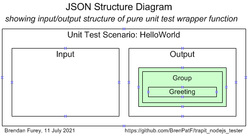
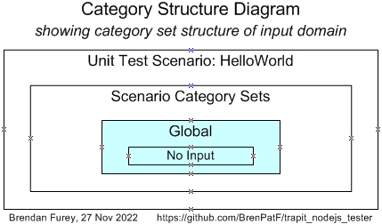
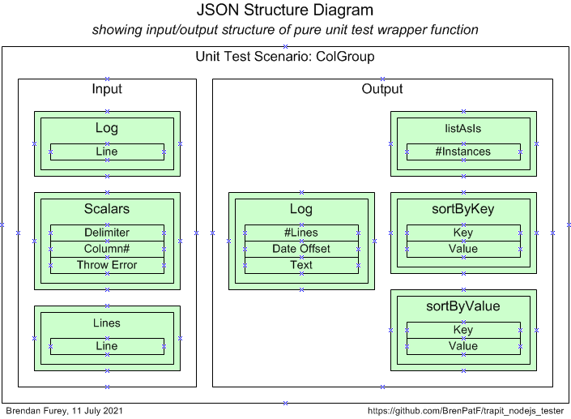
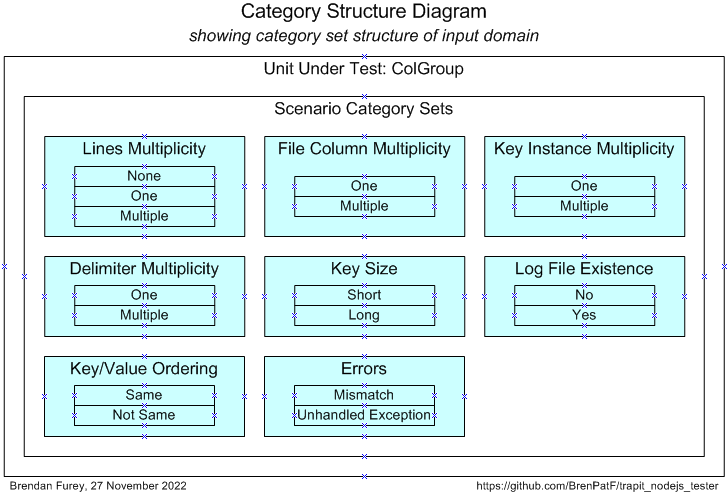
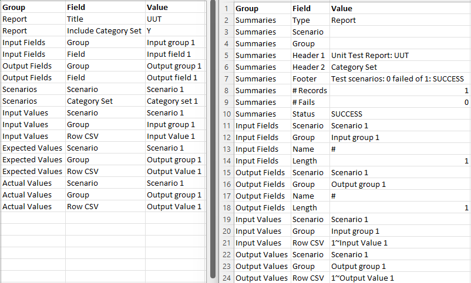
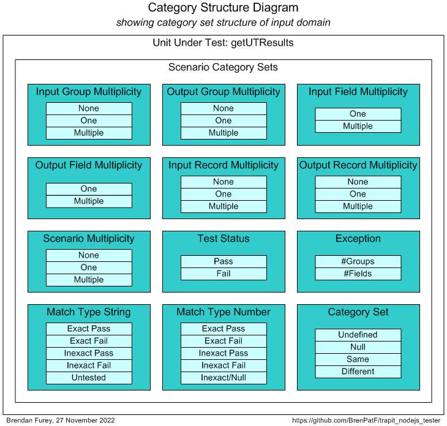
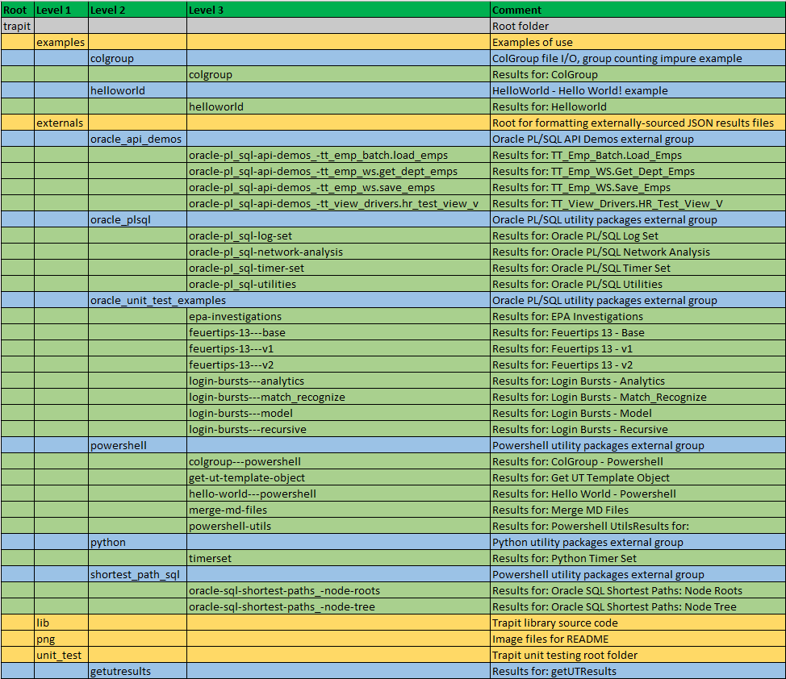

# Trapit - JavaScript Unit Tester/Formatter


> The Math Function Unit Testing design pattern, implemented in JavaScript

:detective:

This module supports a new design pattern for unit testing that can be applied in any language, and is here implemented in JavaScript. The module name is derived from 'TRansactional API Testing' (TRAPIT), and the 'unit' should be considered to be a transactional unit. This is not micro-testing: It is data-driven and fully supports multi-scenario testing and re-factoring.

The Trapit module supports the complete process for testing JavaScript programs, and, for non-JavaScript programs following the design pattern, formats the results by reading in a results object from a JSON file materialized by the external unit test program.

This blog post, [Unit Testing, Scenarios and Categories: The SCAN Method](https://brenpatf.github.io/jekyll/update/2021/10/17/unit-testing-scenarios-and-categories-the-scan-method.html) provides guidance on effective  selection of scenarios for unit testing.

There is also a powershell module, [Powershell Trapit Unit Testing Utilities module](https://github.com/BrenPatF/powershell_utils/tree/master/TrapitUtils) that includes a utility to generate a template for the JSON input file used by the design pattern, based on simple input CSV files. The resulting JSON file contains sections for the input and output metadata, and a scenario skeleton for each scenario listed in the relevant CSV file.

There is an extended Usage section below that illustrates the use of the powershell utility, along with the JavaScript program, for unit testing, by means of two examples. The Unit Testing section also uses them in testing the pure function, getUTResults, which is called by the JavaScript formatting APIs.

# In This README...
[&darr; Background](#background)<br />
[&darr; Usage](#usage)<br />
[&darr; API](#api)<br />
[&darr; Installation](#installation)<br />
[&darr; Unit Testing](#unit-testing)<br />
[&darr; Folder Structure](#folder-structure)<br />
[&darr; See Also](#see-also)<br />
## Background
[&uarr; In This README...](#in-this-readme)<br />

I explained the concepts for the unit testing design pattern in relation specifically to database testing in a presentation at the Oracle User Group Ireland Conference in March 2018:

- [The Database API Viewed As A Mathematical Function: Insights into Testing](https://www.slideshare.net/brendanfurey7/database-api-viewed-as-a-mathematical-function-insights-into-testing)

I later named the approach 'The Math Function Unit Testing design pattern' when I applied it in Javascript and wrote a JavaScript program to format results both in plain text and as HTML pages:
- [Trapit - JavaScript Unit Tester/Formatter](https://github.com/BrenPatF/trapit_nodejs_tester)

The module also allowed for the formatting of results obtained from testing in languages other than JavaScript by means of an intermediate output JSON file. In 2021 I developed a powershell module that included a utility to generate a template for the JSON input scenarios file required by the design pattern:
- [Powershell Trapit Unit Testing Utilities module.](https://github.com/BrenPatF/powershell_utils/tree/master/TrapitUtils)

Also in 2021 I developed a systematic approach to the selection of unit test scenarios:
- [Unit Testing, Scenarios and Categories: The SCAN Method](https://brenpatf.github.io/jekyll/update/2021/10/17/unit-testing-scenarios-and-categories-the-scan-method.html)

In early 2023 I extended both the the JavaScript results formatter, and the powershell utility to incorporate Category Set as a scenario attribute. Both utilities support use of the design pattern in any language, while the unit testing driver utility is language-specific and is currently available in Powershell, JavaScript, Python and Oracle PL/SQL versions.
## Usage
[&uarr; In This README...](#in-this-readme)<br />
[&darr; General Usage](#general-usage)<br />
[&darr; Usage 1 - JavaScript Unit Testing](#usage-1---javascript-unit-testing)<br />
[&darr; Usage 2 - Formatting Test Results for External Programs](#usage-2---formatting-test-results-for-external-programs)<br />

As noted above, the JavaScript module allows for unit testing of JavaScript programs and also the formatting of test results for both JavaScript and non-JavaScript programs. Similarly, the powershell module mentioned allows for unit testing of powershell programs, and also the generation of the JSON input scenarios file template for testing in any language.

In this section we'll start by describing the steps involved in The Math Function Unit Testing design pattern at an overview level. This will show how the generic powershell and JavaScript utilities fit in alongside the language-specific driver utilities.

Secondly, we'll show how to use the design pattern in unit testing JavaScript programs by means of two simple examples.

Finally, we'll show how to use the JavaScript formatting utility in unit testing non-JavaScript programs, where the utility uses an intermediate JSON file created from the external programs as input. This section contains a set of examples with results summaries and links to the GitHub projects generating the JSON files.

### General Usage
[&uarr; Usage](#usage)<br />
[&darr; Step 1: Create JSON File](#step-1-create-json-file)<br />
[&darr; Step 2: Create Results Object](#step-2-create-results-object)<br />
[&darr; Step 3: Format Results](#step-3-format-results)<br />

At a high level the Math Function Unit Testing design pattern involves three main steps:

1. Create an input file containing all test scenarios with input data and expected output data for each scenario, as well as metadata describing the structure
2. Create a results object based on the input file, but with actual outputs merged in, based on calls to the unit under test
3. Use the results object to generate unit test results files formatted in HTML and/or text


<br />
The first and third of these steps are supported by generic utilities that can be used in unit testing in any language. The second step uses a language-specific unit test driver utility.

#### Step 1: Create JSON File
[&uarr; General Usage](#general-usage)<br />

Step 1 requires analysis to determine the extended signature for the unit under test, and to determine appropriate scenarios to test.

The art of unit testing lies in choosing a set of scenarios that will produce a high degree of confidence in the functioning of the unit under test across the often very large range of possible inputs. A useful approach to this can be to think in terms of categories of inputs, where we reduce large ranges to representative categories, an approach discussed in [Unit Testing, Scenarios and Categories: The SCAN Method](https://brenpatf.github.io/jekyll/update/2021/10/17/unit-testing-scenarios-and-categories-the-scan-method.html). While the examples in the blog post aimed at minimal sets of scenarios, we have since found it simpler and clearer to use a separate scenario for each category.

The results of this analysis can be summarised in three CSV files which a powershell API uses as inputs to create a template for the JSON file.

The powershell API, `Write-UT_Template`, creates a template for the JSON file, with the full meta section, and a set of template scenarios having name as scenario key, a category set attribute, and a single record with default values for each input and output group. The API takes as inputs three CSV files:
  - `stem`_inp.csv: Input group triplets - (Input group name, field name, default value)
  - `stem`_out.csv: Input group triplets - (Output group name, field name, default value)
  - `stem`_sce.csv: Scenario triplets - (Category set, scenario name, active flag)


It may be useful during the analysis phase to create two diagrams, one for the extended signature:
- JSON Structure Diagram: showing the groups with their fields for input and output

and another for the category sets and categories:
- Category Structure Diagram: showing the category sets identified with their categories

You can see examples of these diagrams later in this document, eg: [JSON Structure Diagram - ColGroup](#unit-test-wrapper-function---colgroup) and [Category Structure Diagram - ColGroup](#scenario-category-analysis-scan---colgroup).

The API can be run (after installing the TrapitUtils module) with the following powershell in the folder of the CSV files:

##### Format-JSON-Stem.ps1
```powershell
Import-Module TrapitUtils
Write-UT_Template 'stem' '|'
```
This creates the template JSON file, `stem`_temp.json based on the CSV files having prefix `stem` and using the field delimiter '|'.

This powershell API can be used for testing in any language.

#### Step 2: Create Results Object
[&uarr; General Usage](#general-usage)<br />
[&darr; JavaScript](#javascript)<br />
[&darr; External Programs](#external-programs)<br />

Step 2 requires the writing of a wrapper function that is passed into a call to the unit test driver API. Both wrapper function and driver API are in the language of the unit under test.

In scripting languages, such as JavaScript or Python, there will be a driving script containing the wrapper function definition, followed by a 1-line call to the driver API in a library module. In a database language, such as Oracle PL/SQL the wrapper function would be in a stored package, and called by the driver API internally depending on a parameter passed.

The driver API reads the input JSON file, calls the wrapper function for each scenario, and creates the output JSON object with the actual results merged in along with the expected results.

In the JavaScript version of the unit test driver API, the object is used directly to create the formatted HTML and text results files; in non-JavaScript versions the object is written to file to be read by the JavaScript formatter in a separate step.

##### JavaScript
[&uarr; Step 2: Create Results Object](#step-2-create-results-object)<br />

The unit test driver script in Javascript has the form:

###### test-uut.js
```js
const Trapit = require('trapit');
function purelyWrapUnit(inpGroups) { // input groups object
(function body)
}
Trapit.fmtTestUnit(INPUT_JSON, ROOT, purelyWrapUnit, 'B', colors);
```
If the script, test-uut.js, is in path [path], we would call it like this:
```js
$ node [path]/test-uut
```
The call creates the results object and goes on to format it, producing listings of the results in HTML and/or text format in a subfolder named from the unit test title.

##### External Programs
[&uarr; Step 2: Create Results Object](#step-2-create-results-object)<br />

For external programs, the scripts create the object and materialize it as a JSON file. There are projects, with library module and examples, under this GitHub account (BrenPatF) for Powershell, Python and Oracle PL/SQL at present. For example, in Python the driver script has the form:

###### testuut.py
```py
import trapit
def purely_wrap_unit(inp_groups): # input groups object
  (function body)
trapit.test_unit(INPUT_JSON, OUTPUT_JSON, purely_wrap_unit)
```
where now we pass in an output JSON file name, OUTPUT_JSON, as well as the input file name.

If the script, testuut.py, is in path [path] we would call it like this:
```py
$ py [path]/testuut
```

#### Step 3: Format Results
[&uarr; General Usage](#general-usage)<br />

As mentioned, for JavaScript step 3 is incorporated within the API called for step 2. Other languages require the use of a JavaScript program that reads in the JSON from step 2. In either case the formatter produces listings of the results in HTML and/or text format in a subfolder named from the unit test title.

There are a number of ways to use the JavaScript module for the formatting step of non-JavaScript unit testing.

- `format-external-file.js`: Formats the results for a single JSON file, within a subfolder of the file's parent folder
- `format-external-folder.js`: Formats the results for all JSON files in a general folder, within subfolders
- `format-externals.js`: Formats the results for all JSON files in a subfolder of the Trapit externals folder, within subfolders

Each of these returns a summary of the results. Here is an example of a call from powershell to the first script:
```ps
$ node ($npmRoot + '/node_modules/trapit/externals/format-external-file') $jsonFile
```
The call would normally be encapsulated within a function in a library package in the non-JavaScript language, as in:
- [Powershell Trapit Unit Testing Utilities module](https://github.com/BrenPatF/powershell_utils/tree/master/TrapitUtils)

These JavaScript APIs can be used for formatting the test results objects created in any language.

### Usage 1 - JavaScript Unit Testing
[&uarr; Usage](#usage)<br />
[&darr; Example 1 - HelloWorld](#example-1---helloworld)<br />
[&darr; Example 2 - ColGroup](#example-2---colgroup)<br />

For JavaScript programs tested using the Math Function Unit Testing design pattern, the results object is created within the JavaScript library package. The diagram below shows the flow of processing triggered by the specific test package main function:
- First, the output results object is created by the Test Unit library function
- Second, the function calls another function to format the results in HTML and/or text files

This creates a subfolder with name based on the unit test title within the input JSON file, and also outputs a table of summary results. The processing is split between three code units:
- Trapit library package with Test Unit function that drives the unit testing with a callback to a specific wrapper function, then calls the Format Results function to do the formatting
- Specific Test Package: This has a 1-line main program to call the library driver function, passing in the callback wrapper function
- Unit Under Test: Called by the wrapper function, which converts between its specific inputs and outputs and the generic version used by the library package


This section illustrates the usage of the package for testing JavaScript programs by means of two examples. The first is a version of the 'Hello World' program traditionally used as a starting point in learning a new programming language. This is useful as it shows the core structures involved in following the design pattern with a minimalist unit under test.

The second example, 'ColGroup', is larger and intended to show a wider range of features, but without too much extraneous detail.

#### Example 1 - HelloWorld
[&uarr; Usage 1 - JavaScript Unit Testing](#usage-1---javascript-unit-testing)<br />
[&darr; Step 1: Create JSON File - HelloWorld](#step-1-create-json-file---helloworld)<br />
[&darr; Step 2: Create Results Object - HelloWorld](#step-2-create-results-object---helloworld)<br />
[&darr; Step 3: Format Results - HelloWorld](#step-3-format-results---helloworld)<br />

This is a pure function form of Hello World program, returning a value rather than writing to screen itself. It is of course trivial, but has some interest as an edge case with no inputs and extremely simple JSON input structure and test code.
##### helloWorld.js
```js
module.exports = {
  helloWorld: () => {return 'Hello World!'}
}
```
There is a main script that shows how the function might be called outside of unit testing, run from the examples folder:

##### main-helloworld.js
```js
const Hw = require('./helloworld');
console.log(Hw.helloWorld());
```
This can be called from a command window in the examples folder:
```js
$ node helloworld/main-helloworld
```

with output to console:
```
Hello World!
```

##### Step 1: Create JSON File - HelloWorld
[&uarr; Example 1 - HelloWorld](#example-1---helloworld)<br />
[&darr; Unit Test Wrapper Function - HelloWorld](#unit-test-wrapper-function---helloworld)<br />
[&darr; Scenario Category ANalysis (SCAN) - HelloWorld](#scenario-category-analysis-scan---helloworld)<br />

###### Unit Test Wrapper Function - HelloWorld
[&uarr; Step 1: Create JSON File - HelloWorld](#step-1-create-json-file---helloworld)<br />

Here is a diagram of the input and output groups for this example:



From the input and output groups depicted we can construct CSV files with flattened group/field structures, and default values added, as follows (with `helloworld_inp.csv` left, `helloworld_out.csv` right):


###### Scenario Category ANalysis (SCAN) - HelloWorld
[&uarr; Step 1: Create JSON File - HelloWorld](#step-1-create-json-file---helloworld)<br />

The Category Structure diagram for the HelloWorld example is of course trivial:



It has just one scenario, with its input being void:

|  # | Category Set | Category | Scenario |
|---:|:-------------|:---------|:---------|
|  1 | Global       | No input | No input |

From the scenarios identified we can construct the following CSV file (`helloworld_sce.csv`), taking the category set and scenario columns, and adding an initial value for the active flag:


The powershell API can be run with the following powershell script in the folder of the CSV files:

##### Format-JSON-HelloWorld.ps1
```powershell
Import-Module TrapitUtils
Write-UT_Template 'helloworld' '|'
```
This creates the template JSON file, helloworld_temp.json, which contains an element for each of the scenarios, with the appropriate category set and active flag, with a single record in each group with default values from the groups CSV files. Here is the complete file:

##### helloworld_temp.json
```js
{
  "meta": {
    "title": "title",
    "delimiter": "|",
    "inp": {},
    "out": {
      "Group": [
        "Greeting"
      ]
    }
  },
  "scenarios": {
    "No input": {
      "active_yn": "Y",
      "category_set": "Global",
      "inp": {},
      "out": {
        "Group": [
          "Hello World!"
        ]
      }
    }
  }
}
```
The actual JSON file has just the "title" value replaced with: "HelloWorld - JavaScript".

##### Step 2: Create Results Object - HelloWorld
[&uarr; Example 1 - HelloWorld](#example-1---helloworld)<br />

Step 2 requires the writing of a wrapper function that is passed into a call to the unit test driver API.

- `Trapit.fmtTestUnit` is the unit test driver API that reads the input JSON file, calls the wrapper function for each scenario, and creates the output object with the actual results merged in along with the expected results.

Here is the complete script for this case, where we use a Lambda expression as the wrapper function is so simple:

###### test-helloworld.js
```js
const [Trapit,                    Hw                     ] =
      [require('trapit'),         require('./helloworld')],
      [ROOT,                      GROUP                  ] =
      [__dirname + '/',           'Group'                ];

const INPUT_JSON = ROOT + 'helloworld.json';

Trapit.fmtTestUnit(INPUT_JSON, ROOT, (inpGroups) => { return {[GROUP] : [Hw.helloWorld()]} }, 'B');
```
This creates the output object and goes on to format it, producing listings of the results in HTML and/or text format in a subfolder named from the unit test title, here `helloworld`.

##### Step 3: Format Results - HelloWorld
[&uarr; Example 1 - HelloWorld](#example-1---helloworld)<br />
[&darr; Unit Test Report - HelloWorld](#unit-test-report---helloworld)<br />
[&darr; Scenario 1: No input](#scenario-1-no-input)<br />

Here we show the scenario-level summary of results for the specific example, and also show the detail for the only scenario.

You can review the HTML formatted unit test results here:

- [Unit Test Report: Hello World](http://htmlpreview.github.io/?https://github.com/BrenPatF/trapit_nodejs_tester/blob/master/examples/helloworld/hello-world---javascript/hello-world---javascript.html)

###### Unit Test Report - HelloWorld
[&uarr; Step 3: Format Results - HelloWorld](#step-3-format-results---helloworld)<br />

This is the summary page in text format.

```
Unit Test Report: Hello World - JavaScript
==========================================

      #    Scenario  Fails (of 2)  Status
      ---  --------  ------------  -------
      1    Scenario  0             SUCCESS

Test scenarios: 0 failed of 1: SUCCESS
======================================
Formatted: 2023-04-09 13:49:09
```

###### Scenario 1: No input
[&uarr; Step 3: Format Results - HelloWorld](#step-3-format-results---helloworld)<br />

This is the page for the single scenario in text format.

```
SCENARIO 1: No input [Category Set: Global] {
=============================================
   INPUTS
   ======
   OUTPUTS
   =======
      GROUP 1: Group {
      ================
            #  Greeting
            -  ------------
            1  Hello World!
      } 0 failed of 1: SUCCESS
      ========================
      GROUP 2: Unhandled Exception: Empty as expected: SUCCESS
      ========================================================
} 0 failed of 2: SUCCESS
========================
```
Note that the second output group, 'Unhandled Exception', is not specified in the CSV file: In fact, this is generated by the unit test driver API itself in order to capture any unhandled exception.
#### Example 2 - ColGroup
[&uarr; Usage 1 - JavaScript Unit Testing](#usage-1---javascript-unit-testing)<br />
[&darr; Step 1: Create JSON File - ColGroup](#step-1-create-json-file---colgroup)<br />
[&darr; Step 2: Create Results Object - ColGroup](#step-2-create-results-object---colgroup)<br />
[&darr; Step 3: Format Results - ColGroup](#step-3-format-results---colgroup)<br />

This example involves a class with a constructor function that reads in a CSV file and counts instances of distinct values in a given column. The constructor function appends a timestamp and call details to a log file. The class has methods to list the value/count pairs in several orderings.

##### ColGroup.js (skeleton)
```js
...
class ColGroup {
    ...
}
module.exports = ColGroup;
```

There is a main script that shows how the class might be called outside of unit testing, run from the examples folder:

##### main-colgroup.js
```js
const ColGroup = require('./colgroup');
const [INPUT_FILE,                                             DELIM, COL] =
      [__dirname + '/fantasy_premier_league_player_stats.csv', ',',   6];

let grp = new ColGroup(INPUT_FILE, DELIM, COL);

grp.prList('(as is)', grp.listAsIs());
grp.prList('key', grp.sortByKey());
grp.prList('value', grp.sortByValue());
```
This can be called from a command window in the examples folder:

```js
$ node colgroup/main-colgroup
```
with output to console:

```
Counts sorted by (as is)
========================
Team         #apps
-----------  -----
Man City      1099
Southampton   1110
Stoke City    1170
...

Counts sorted by key
====================
Team         #apps
-----------  -----
Arsenal        534
Aston Villa    685
Blackburn       33
...
Counts sorted by value
======================
Team         #apps
-----------  -----
Wolves          31
Blackburn       33
Bolton          37
...
```
and to log file, fantasy_premier_league_player_stats.csv.log:
```
Mon Apr 10 2023 07:46:22: File [MY_PATH]/node_modules/trapit/examples/colgroup/fantasy_premier_league_player_stats.csv, delimiter ',', column 6/fantasy_premier_league_player_stats.csv, delimiter ',', column team_name
```

The example illustrates how a wrapper function can handle `impure` features of the unit under test:
- Reading input from file
- Writing output to file

...and also how the JSON input file can allow for nondeterministic outputs giving rise to deterministic test outcomes:
- By using regex matching for strings including timestamps
- By using number range matching and converting timestamps to epochal offsets (number of units of time since a fixed time)

##### Step 1: Create JSON File - ColGroup
[&uarr; Example 2 - ColGroup](#example-2---colgroup)<br />
[&darr; Unit Test Wrapper Function - ColGroup](#unit-test-wrapper-function---colgroup)<br />
[&darr; Scenario Category ANalysis (SCAN) - ColGroup](#scenario-category-analysis-scan---colgroup)<br />

###### Unit Test Wrapper Function - ColGroup
[&uarr; Step 1: Create JSON File - ColGroup](#step-1-create-json-file---colgroup)<br />

Here is a diagram of the input and output groups for this example:



From the input and output groups depicted we can construct CSV files with flattened group/field structures, and default values added, as follows (with `colgroup_inp.csv` left, `colgroup_out.csv` right):


###### Scenario Category ANalysis (SCAN) - ColGroup
[&uarr; Step 1: Create JSON File - ColGroup](#step-1-create-json-file---colgroup)<br />

After analysis of the possible scenarios in terms of categories and category sets, we can depict them on a Category Structure diagram:



We can tabulate the results of the category analysis, and assign a scenario against each category set/category with a unique description:

|  # | Category Set              | Category            | Scenario                                 |
|---:|:--------------------------|:--------------------|:-----------------------------------------|
|  1 | Lines Multiplicity        | None                | No lines                                 |
|  2 | Lines Multiplicity        | One                 | One line                                 |
|  3 | Lines Multiplicity        | Multiple            | Multiple lines                           |
|  4 | File Column Multiplicity  | One                 | One column in file                       |
|  5 | File Column Multiplicity  | Multiple            | Multiple columns in file                 |
|  6 | Key Instance Multiplicity | One                 | One key instance                         |
|  7 | Key Instance Multiplicity | Multiple            | Multiple key instances                   |
|  8 | Delimiter Multiplicity    | One                 | One delimiter character                  |
|  9 | Delimiter Multiplicity    | Multiple            | Multiple delimiter characters            |
| 10 | Key Size                  | Short               | Short key                                |
| 11 | Key Size                  | Long                | Long key                                 |
| 12 | Log file existence        | No                  | Log file does not exist at time of call  |
| 13 | Log file existence        | Yes                 | Log file exists at time of call          |
| 14 | Key/Value Ordering        | Same                | Order by key same as order by value      |
| 15 | Key/Value Ordering        | Not Same            | Order by key differs from order by value |
| 16 | Errors                    | Mismatch            | Actual/expected mismatch                 |
| 17 | Errors                    | Unhandled Exception | Unhandled exception                      |

From the scenarios identified we can construct the following CSV file (`colgroup_sce.csv`), taking the category set and scenario columns, and adding an initial value for the active flag:


The powershell API can be run with the following powershell script in the folder of the CSV files:

##### Format-JSON-ColGroup.ps1
```powershell
Import-Module TrapitUtils
Write-UT_Template 'colgroup' '|'
```
This creates the template JSON file, colgroup_temp.json, which contains an element for each of the scenarios, with the appropriate category set and active flag, with a single record in each group with default values from the groups CSV files. Here is the "Multiple lines" element:

    "Multiple lines": {
      "active_yn": "N",
      "category_set": "Lines Multiplicity",
      "inp": {
        "Log": [
          ""
        ],
        "Scalars": [
          ",|col_1|N"
        ],
        "Lines": [
          "col_0,col_1,col_2"
        ]
      },
      "out": {
        "Log": [
          "1|IN [0,2000]|LIKE /.*: File .*ut_group.*.csv, delimiter ',', column 0/"
        ],
        "listAsIs": [
          "1"
        ],
        "sortByKey": [
          "val_1|1"
        ],
        "sortByValue": [
          "val_1|1"
        ]
      }
    },

For each scenario element, we need to update the values to reflect the scenario to be tested, in the actual input JSON file, colgroup.json. In the case above, we can just replace the "Lines" input group with:

        "Lines": [
          "col_0,col_1,col_2",
          "val_0,val_1,val_2",
          "val_0,val_1,val_2"
        ]

and replace '1' with '2' in two of the output groups:

        "sortByKey": [
          "val_1|2"
        ],
        "sortByValue": [
          "val_1|2"
        ]

##### Step 2: Create Results Object - ColGroup
[&uarr; Example 2 - ColGroup](#example-2---colgroup)<br />

Step 2 requires the writing of a wrapper function that is passed into a call to the second API.

- `Trapit.fmtTestUnit` is the unit test driver API that reads the input JSON file, calls the wrapper function for each scenario, and creates the output object with the actual results merged in along with the expected results.

Here is a skeleton of the script for this case:

###### test-colgroup.js (skeleton)
```js
const Trapit = require('trapit');
function purelyWrapUnit(inpGroups) { // input groups object
(function body)
}
Trapit.fmtTestUnit(INPUT_JSON, ROOT, purelyWrapUnit, 'B', colors);
```
This creates the output object and goes on to format it, producing listings of the results in HTML and/or text format in a subfolder named from the unit test title, here colgroup.

##### Step 3: Format Results - ColGroup
[&uarr; Example 2 - ColGroup](#example-2---colgroup)<br />
[&darr; Unit Test Report - ColGroup](#unit-test-report---colgroup)<br />
[&darr; Scenario 16: Actual/expected mismatch [Category Set: Errors]](#scenario-16-actualexpected-mismatch-category-set-errors)<br />

Here we show the scenario-level summary of results for the specific example, and also show the detail for one scenario.

You can review the HTML formatted unit test results here:

- [Unit Test Report: ColGroup](http://htmlpreview.github.io/?https://github.com/BrenPatF/trapit_nodejs_tester/blob/master/examples/colgroup/colgroup---javascript/colgroup---javascript.html)

###### Unit Test Report - ColGroup
[&uarr; Step 3: Format Results - ColGroup](#step-3-format-results---colgroup)<br />

This is the summary page in text format.

```
Unit Test Report: ColGroup - JavaScript
=======================================

      #    Category Set               Scenario                                  Fails (of 5)  Status
      ---  -------------------------  ----------------------------------------  ------------  -------
      1    Lines Multiplicity         No lines                                  0             SUCCESS
      2    Lines Multiplicity         One line                                  0             SUCCESS
      3    Lines Multiplicity         Multiple lines                            0             SUCCESS
      4    File Column Multiplicity   One column in file                        0             SUCCESS
      5    File Column Multiplicity   Multiple columns in file                  0             SUCCESS
      6    Key Instance Multiplicity  One key instance                          0             SUCCESS
      7    Key Instance Multiplicity  Multiple key instances                    0             SUCCESS
      8    Delimiter Multiplicity     One delimiter character                   0             SUCCESS
      9    Delimiter Multiplicity     Multiple delimiter characters             0             SUCCESS
      10   Key Size                   Short key                                 0             SUCCESS
      11   Key Size                   Long key                                  0             SUCCESS
      12   Log file existence         Log file does not exist at time of call   0             SUCCESS
      13   Log file existence         Log file exists at time of call           0             SUCCESS
      14   Key/Value Ordering         Order by key differs from order by value  0             SUCCESS
      15   Key/Value Ordering         Order by key same as order by value       0             SUCCESS
      16*  Errors                     Actual/expected mismatch                  1             FAILURE
      17*  Errors                     Unhandled exception                       5             FAILURE

Test scenarios: 2 failed of 17: FAILURE
=======================================
Formatted: 2023-04-09 13:49:09
```

###### Scenario 16: Actual/expected mismatch [Category Set: Errors]
[&uarr; Step 3: Format Results - ColGroup](#step-3-format-results---colgroup)<br />

This scenario is designed to fail, with one of the expected values in group 4 set to 9999 instead of the correct value of 2,  just to show how mismatches are displayed.

```
SCENARIO 16: Actual/expected mismatch [Category Set: Errors] {
==============================================================
   INPUTS
   ======
      GROUP 1: Log {
      ==============
            #  Line
            -  ----
            1
      }
      =
      GROUP 2: Scalars {
      ==================
            #  Delimiter  Column#  Throw Error
            -  ---------  -------  -----------
            1  ,          1        N
      }
      =
      GROUP 3: Lines {
      ================
            #  Line
            -  ------------------
            1  col_0,col_1,col_2
            2  val_0,val_11,val_2
            3  val_0,val_10,val_2
            4  val_0,val_11,val_2
      }
      =
   OUTPUTS
   =======
      GROUP 1: Log {
      ==============
            #  #Lines  Date Offset       Text
            -  ------  ----------------  -------------------------------------------------------------------------------------------------------------------------------------------------
            1  2       IN [0,2000]: 665  LIKE /.*: File .*ut_group.csv, delimiter ',', column 1/: Mon Jan 23 2023 16:18:24: File ./examples/colgroup/ut_group.csv, delimiter ',', column 1
      } 0 failed of 1: SUCCESS
      ========================
      GROUP 2: listAsIs {
      ===================
            #  #Instances
            -  ----------
            1  2
      } 0 failed of 1: SUCCESS
      ========================
      GROUP 3: sortByKey {
      ====================
            #  Key     Value
            -  ------  -----
            1  val_10  1
            2  val_11  2
      } 0 failed of 2: SUCCESS
      ========================
      GROUP 4: sortByValue {
      ======================
            #   Key     Value
            --  ------  -----
            1   val_10  1
            2   val_11  9999
            2*  val_11  2
      } 1 failed of 2: FAILURE
      ========================
      GROUP 5: Unhandled Exception: Empty as expected: SUCCESS
      ========================================================
} 1 failed of 5: FAILURE
========================
```
### Usage 2 - Formatting Test Results for External Programs
[&uarr; Usage](#usage)<br />
[&darr; Results Summaries for External Folders](#results-summaries-for-external-folders)<br />

For non-JavaScript programs tested using the Math Function Unit Testing design pattern, the results object is materialized using a library package in the relevant language. The diagram below shows how the processing is split into two steps:
- First, the output results object is created using the external library package in a similar way to the JavaScript processing, and is then written to a JSON file
- Second, a JavasScript script from the current project is run, passing in the name of the folder with the results JSON file(s)

This creates a subfolder for each JSON file with name based on the unit test title within the file, and also outputs a table of summary results for each file. The processing is split between three code units in a similar way to the JavaScript case:
- Test Unit: External library function that drives the unit testing with a callback to a specific wrapper function
- Specific Test Package: This has a 1-line main program to call the library driver function, passing in the callback wrapper function
- Unit Under Test: Called by the wrapper function, which converts between its specific inputs and outputs and the generic version used by the library package


In the first step the external program creates the output results JSON file, while in the second step the file is read into an object by the Trapit library package, which then formats the results in exactly the same way as for JavaScript testing.

As mentioned in the General Usage section above, there are three alternative JavaScript scripts for formatting non-JavaScript unit test results, and usually the calls would be be encapsulated within a function in a library package in the non-JavaScript language, as in:
- [Powershell Trapit Unit Testing Utilities module](https://github.com/BrenPatF/powershell_utils/tree/master/TrapitUtils)

In the next section below we show the results by subfolder from the script `format-externals.js`, passing as a parameter the name of a subfolder within the `externals` folder. It is run from a Powershell window in the root trapit folder for a `subfolder` containing a set of JSON results files:
```
$ node externals/format-externals subfolder
```

#### Results Summaries for External Folders
[&uarr; Usage 2 - Formatting Test Results for External Programs](#usage-2---formatting-test-results-for-external-programs)<br />
[&darr; oracle_api_demos](#oracle_api_demos)<br />
[&darr; oracle_plsql](#oracle_plsql)<br />
[&darr; oracle_unit_test_examples](#oracle_unit_test_examples)<br />
[&darr; powershell](#powershell)<br />
[&darr; python](#python)<br />
[&darr; shortest_path_sql](#shortest_path_sql)<br />

Here we give the top-level results summaries output to console for each of the groups of externally-sourced JSON files. Links to the source GitHub project are included for each group.

##### oracle_api_demos
[&uarr; Results Summaries for External Folders](#results-summaries-for-external-folders)<br />
The results JSON file is sourced from the following GitHub project, and the formatted results files can be seen in the indicated subfolders:
- [Oracle PL/SQL API Demos - demonstrating instrumentation and logging, code timing and unit testing of Oracle PL/SQL APIs](https://github.com/BrenPatF/oracle_plsql_api_demos)

Running the format-externals script for subfolder oracle_api_demos from a Powershell window in the root trapit folder:

```
$ node externals/format-externals oracle_api_demos
```
gives the following output to console, as well as writing the results subfolders as indicated:

```
Unit Test Results Summary for Folder [MY_PATH]/node_modules/trapit/externals/oracle_api_demos
=============================================================================================
 File                                                 Title                                                    Inp Groups  Out Groups  Tests  Fails  Folder
----------------------------------------------------  -------------------------------------------------------  ----------  ----------  -----  -----  -------------------------------------------------------
 tt_emp_batch.purely_wrap_load_emps_out.json          Oracle PL/SQL API Demos: TT_Emp_Batch.Load_Emps                   5           5      9      0  oracle-pl_sql-api-demos_-tt_emp_batch.load_emps
 tt_emp_ws.purely_wrap_get_dept_emps_out.json         Oracle PL/SQL API Demos: TT_Emp_WS.Get_Dept_Emps                  2           2      5      0  oracle-pl_sql-api-demos_-tt_emp_ws.get_dept_emps
*tt_emp_ws.purely_wrap_save_emps_out.json             Oracle PL/SQL API Demos: TT_Emp_WS.Save_Emps                      1           4      4      1  oracle-pl_sql-api-demos_-tt_emp_ws.save_emps
 tt_view_drivers.purely_wrap_hr_test_view_v_out.json  Oracle PL/SQL API Demos: TT_View_Drivers.HR_Test_View_V           2           2      4      0  oracle-pl_sql-api-demos_-tt_view_drivers.hr_test_view_v

1 externals failed, see [MY_PATH]/node_modules/trapit/externals/oracle_api_demos for scenario listings
tt_emp_ws.purely_wrap_save_emps_out.json
```

##### oracle_plsql
[&uarr; Results Summaries for External Folders](#results-summaries-for-external-folders)<br />
The results JSON files are sourced from the following GitHub projects, and the formatted results files can be seen in the indicated subfolders:
- [Log_Set - Oracle logging module](https://github.com/BrenPatF/log_set_oracle)
- [Net_Pipe - Oracle PL/SQL network analysis module](https://github.com/BrenPatF/plsql_network)
- [Timer_Set - Oracle PL/SQL code timing module](https://github.com/BrenPatF/timer_set_oracle)
- [Utils - Oracle PL/SQL general utilities module](https://github.com/BrenPatF/oracle_plsql_utils)

Running the format-externals script for subfolder oracle_plsql from a Powershell window in the root trapit folder:

```
$ node externals/format-externals oracle_plsql
```
gives the following output to console, as well as writing the results subfolders as indicated:

```
Unit Test Results Summary for Folder [MY_PATH]/node_modules/trapit/externals/oracle_plsql
=========================================================================================
 File                                         Title                           Inp Groups  Out Groups  Tests  Fails  Folder
--------------------------------------------  ------------------------------  ----------  ----------  -----  -----  ------------------------------
 tt_log_set.purely_wrap_log_set_out.json      Oracle PL/SQL Log Set                    6           6     21      0  oracle-pl_sql-log-set
 tt_net_pipe.purely_wrap_all_nets_out.json    Oracle PL/SQL Network Analysis           1           2      3      0  oracle-pl_sql-network-analysis
 tt_timer_set.purely_wrap_timer_set_out.json  Oracle PL/SQL Timer Set                  2           9      8      0  oracle-pl_sql-timer-set
 tt_utils.purely_wrap_utils_out.json          Oracle PL/SQL Utilities                 15          16      4      0  oracle-pl_sql-utilities

0 externals failed, see [MY_PATH]/node_modules/trapit/externals/oracle_plsql for scenario listings
```

##### oracle_unit_test_examples
[&uarr; Results Summaries for External Folders](#results-summaries-for-external-folders)<br />
The results JSON files are sourced from the following GitHub project, and the formatted results files can be seen in the indicated subfolders:
- [Oracle Unit Test Examples](https://github.com/BrenPatF/oracle_unit_test_examples)

Running the format-externals script for subfolder oracle_plsql from a Powershell window in the root trapit folder:

```
$ node externals/format-externals oracle_unit_test_examples
```
gives the following output to console, as well as writing the results subfolders as indicated:

```
Unit Test Results Summary for Folder [MY_PATH]/node_modules/trapit/externals/oracle_unit_test_examples
======================================================================================================
 File                                                         Title                           Inp Groups  Out Groups  Tests  Fails  Folder
------------------------------------------------------------  ------------------------------  ----------  ----------  -----  -----  ------------------------------
*tt_feuertips_13.purely_wrap_feuertips_13_poc_out.json        Feuertips 13 - Base                      3           3     15     11  feuertips-13---base
*tt_feuertips_13_v1.purely_wrap_feuertips_13_poc_out.json     Feuertips 13 - v1                        3           3     15      7  feuertips-13---v1
 tt_feuertips_13_v2.purely_wrap_feuertips_13_poc_out.json     Feuertips 13 - v2                        3           3     15      0  feuertips-13---v2
 tt_investigation_mgr.purely_wrap_investigation_mgr_out.json  EPA Investigations                       2           2      9      0  epa-investigations
*tt_login_bursts.purely_wrap_view_ana_out.json                Login Bursts - Analytics                 1           2      3      2  login-bursts---analytics
 tt_login_bursts.purely_wrap_view_mod_out.json                Login Bursts - Model                     1           2      3      0  login-bursts---model
 tt_login_bursts.purely_wrap_view_mre_out.json                Login Bursts - Match_Recognize           1           2      3      0  login-bursts---match_recognize
 tt_login_bursts.purely_wrap_view_rsf_out.json                Login Bursts - Recursive                 1           2      3      0  login-bursts---recursive

3 externals failed, see [MY_PATH]/node_modules/trapit/externals/oracle_unit_test_examples for scenario listings
tt_feuertips_13.purely_wrap_feuertips_13_poc_out.json
tt_feuertips_13_v1.purely_wrap_feuertips_13_poc_out.json
tt_login_bursts.purely_wrap_view_ana_out.json
```

##### powershell
[&uarr; Results Summaries for External Folders](#results-summaries-for-external-folders)<br />
The results JSON file is sourced from the following GitHub project, and the formatted results files can be seen in the indicated subfolder:
- [Powershell utilities module](https://github.com/BrenPatF/powershell_utils)

Running the format-externals script for subfolder powershell from a Powershell window in the root trapit folder:

```
$ node externals/format-externals powershell
```
gives the following output to console, as well as writing the results subfolders as indicated:

```
Unit Test Results Summary for Folder [MY_PATH]/node_modules/trapit/externals/powershell
=======================================================================================
 File                             Title                     Inp Groups  Out Groups  Tests  Fails  Folder
--------------------------------  ------------------------  ----------  ----------  -----  -----  ------------------------
*colgroup_out.json                ColGroup - Powershell              3           5     17      3  colgroup---powershell
 get_ut_template_object_out.json  Get UT Template Object             4           6     18      0  get-ut-template-object
 helloworld_out.json              Hello World - Powershell           0           2      1      0  hello-world---powershell
 merge-mdfiles_out.json           Merge MD Files                     3           3      5      0  merge-md-files
 ps_utils_out.json                Powershell Utils                   7           6      6      0  powershell-utils

1 externals failed, see [MY_PATH]/node_modules/trapit/externals/powershell for scenario listings
colgroup_out.json
```

##### python
[&uarr; Results Summaries for External Folders](#results-summaries-for-external-folders)<br />
The results JSON file is sourced from the following GitHub project, and the formatted results files can be seen in the indicated subfolder:
- [timerset_python - Python code timing module](https://github.com/BrenPatF/timerset_python)

Running the format-externals script for subfolder python from a Powershell window in the root trapit folder:

```
$ node externals/format-externals python
```
gives the following output to console, as well as writing the results subfolders as indicated:

```
Unit Test Results Summary for Folder [MY_PATH]/node_modules/trapit/externals/python
===================================================================================
 File                  Title               Inp Groups  Out Groups  Tests  Fails  Folder
---------------------  ------------------  ----------  ----------  -----  -----  ------------------
*colgroup_out.json     Col Group                    3           4      5      1  col-group
 helloworld_out.json   Hello World                  0           1      1      0  hello-world
 timerset_py_out.json  Python Timer Set             2           8      7      0  python-timer-set
 trapit_py_out.json    Python Unit Tester           7           6      4      0  python-unit-tester

1 externals failed, see [MY_PATH]/node_modules/trapit/externals/python for scenario listings
colgroup_out.json
```

##### shortest_path_sql
[&uarr; Results Summaries for External Folders](#results-summaries-for-external-folders)<br />
The results JSON file is sourced from the following GitHub project, and the formatted results files can be seen in the indicated subfolder:
- [Shortest Path Analysis of Large Networks by SQL and PL/SQL](https://github.com/BrenPatF/shortest_path_sql)

Running the format-externals script for subfolder python from a Powershell window in the root trapit folder:

```
$ node externals/format-externals shortest_path_sql
```
gives the following output to console, as well as writing the results subfolders as indicated:

```
Unit Test Results Summary for Folder [MY_PATH]/node_modules/trapit/externals/shortest_path_sql
==============================================================================================
 File                                                          Title                                  Inp Groups  Out Groups  Tests  Fails  Folder
-------------------------------------------------------------  -------------------------------------  ----------  ----------  -----  -----  -------------------------------------
 tt_shortest_path_sql.purely_wrap_ins_min_tree_links_out.json  Oracle SQL Shortest Paths: Node Tree            3           2      7      0  oracle-sql-shortest-paths_-node-tree
 tt_shortest_path_sql.purely_wrap_ins_node_roots_out.json      Oracle SQL Shortest Paths: Node Roots           2           2      3      0  oracle-sql-shortest-paths_-node-roots

0 externals failed, see [MY_PATH]/node_modules/trapit/externals/shortest_path_sql for scenario listings
```
## API
[&uarr; In This README...](#in-this-readme)<br />
[&darr; Functions](#functions)<br />
[&darr; Scripts](#scripts)<br />

```js
const Trapit = require('trapit');
```

### Functions
[&uarr; API](#api)<br />
[&darr; testUnit](#testunit)<br />
[&darr; fmtTestUnit](#fmttestunit)<br />
[&darr; mkUTExternalResultsFolders](#mkutexternalresultsfolders)<br />
[&darr; tabMkUTExternalResultsFolders](#tabmkutexternalresultsfolders)<br />

#### testUnit
[&uarr; Functions](#functions)<br />
```
Trapit.testUnit(inpFile, root, purelyWrapUnit, formatType = 'B', colors)
```

This is the base entry point for testing JavaAcript programs. It writes the output results folder and returns a value containing summary data for the unit test. It has the following parameters:

- `inpFile`: JSON input file
- `root`: root folder, where the results output files are to be written, in a subfolder with name based on the report title
- `purelyWrapUnit`: wrapper function, which calls the unit under test passing the appropriate parameters and returning its outputs, with the following signature:
  - Input parameter: 3-level list with test inputs as an object with groups as properties having 2-level arrays of record/field as values: {GROUP: [[String]], ...}
  - Return Value:    2-level list with test outputs as an object with groups as properties having an array of records as delimited fields strings as value: {GROUP: [String], ...}
- `formatType`: format type = H/T/B - Format in HTML/Text/Both; default 'B'
- `colors`: object with HTML heading colours; default {h1: '#FFFF00', h2: '#2AE6C1', h3: '#33F0FF', h4: '#7DFF33'}

and object return value with the following fields:
- `nTest`: number of test scenarios
- `nFail`: number of test scenarios that failed
- `status`: status = SUCCESS/FAIL
- `resFolder`: name of results subfolder
- `nInpGroups`: number of input groups
- `nOutGroups`: number of output groups
- `title`: unit test title

#### fmtTestUnit
[&uarr; Functions](#functions)<br />
```
Trapit.fmtTestUnit(inpFile, root, purelyWrapUnit, formatType = 'B', colors)
```

This is a wrapper function that calls the base entry point Trapit.testUnit with the same parameters and prints its return object to console.

#### mkUTExternalResultsFolders
[&uarr; Functions](#functions)<br />
```
Trapit.mkUTExternalResultsFolders(extFolder, formatType = 'B', colors)
```

This is the base entry point for formatting results JSON files from external programs. It writes the output results folders for each file in the external folder, and returns a value containing unit test summary data for the JSON files as an array of objects. It has the following parameters:

- `extFolder`: external folder, where the results output files are to be written, in a subfolder with name based on the report title
- `formatType`: format type = H/T/B - Format in HTML/Text/Both; default 'B'
- `colors`: object with HTML heading colours; default {h1: '#FFFF00', h2: '#2AE6C1', h3: '#33F0FF', h4: '#7DFF33'}

and array return value with the following fields:
- `file`: JSON results file name
- `nTest`: number of test scenarios
- `nFail`: number of test scenarios that failed
- `status`: status = SUCCESS/FAIL
- `resFolder`: name of results subfolder
- `nInpGroups`: number of input groups
- `nOutGroups`: number of output groups
- `title`: unit test title

#### tabMkUTExternalResultsFolders
[&uarr; Functions](#functions)<br />
```
Trapit.tabMkUTExternalResultsFolders(extFolder, formatType = 'B', colors)
```

This is a wrapper function that calls the base entry point Trapit.mkUTExternalResultsFolders with the same parameters and prints its return array in tabular format to console.

### Scripts
[&uarr; API](#api)<br />
[&darr; format-external-file.js.js](#format-external-filejsjs)<br />
[&darr; format-external-folder.js](#format-external-folderjs)<br />
[&darr; format-externals.js](#format-externalsjs)<br />

#### format-external-file.js.js
[&uarr; Scripts](#scripts)<br />
```
$ node externals/test-external-file inpFile
```
This script reads a JSON results file and creates results files formatted in HTML and text in a
subfolder named from the unit test title, within the same folder as the JSON file. It has the following parameters:

- `inpFile`: JSON results file

and return value:

- [Summary of results]

#### format-external-folder.js
[&uarr; Scripts](#scripts)<br />
```
$ node externals/format-external-folder inpFolder
```
This script loops over all JSON files in a specified folder and creates results files formatted in
HTML and text in a subfolder named from the unit test title. It has the following parameters:

- `inpFolder`: input folder for the JSON files, and where the results output files are to be written, in subfolders with names based on the report titles

and return value:

- [Summary table of results]

#### format-externals.js
[&uarr; Scripts](#scripts)<br />
```
$ node externals/format-externals subFolder
```
This script loops over all JSON files in a specified subfolder and creates results files formatted in
HTML and text in subfolders with names based on the report titles. It has the following parameters:

- `subFolder`: subfolder (of externals folder), where the results output files are to be written,  in subfolders with names based on the report titles

and return value:

- [Summary table of results]

## Installation
[&uarr; In This README...](#in-this-readme)<br />

With [Node.js](https://nodejs.org/en/download) installed, run (from the folder where you want the package to be installed):

```
$ npm install trapit
```
## Unit Testing
[&uarr; In This README...](#in-this-readme)<br />
[&darr; Step 1: Create JSON File](#step-1-create-json-file-1)<br />
[&darr; Step 2: Create Results Object](#step-2-create-results-object-1)<br />
[&darr; Step 3: Format Results](#step-3-format-results-1)<br />

The package itself is tested using the Math Function Unit Testing design pattern. A 'pure' wrapper function is constructed that takes input parameters and returns a value, and is tested within a loop over scenario records read from a JSON file.

In this case, the pure function getUTResults is unit tested explicitly, while the function fmtTestUnit is called as the main section of the unit test script, test-trapit.js.

### Step 1: Create JSON File
[&uarr; Unit Testing](#unit-testing)<br />
[&darr; Unit Test Wrapper Function](#unit-test-wrapper-function)<br />
[&darr; Scenario Category ANalysis (SCAN)](#scenario-category-analysis-scan)<br />

#### Unit Test Wrapper Function
[&uarr; Step 1: Create JSON File](#step-1-create-json-file-1)<br />
[&darr; Wrapper Function Signature Diagram](#wrapper-function-signature-diagram)<br />

The signature of the unit under test is:

    Trapit.getUTResults(inMeta, inScenarios);

where the parameters are input metadata and scenarios objects. The diagram below shows the structure of the input and output of the wrapper function.

##### Wrapper Function Signature Diagram
[&uarr; Unit Test Wrapper Function](#unit-test-wrapper-function)<br />


From the input and output groups depicted we can construct CSV files with flattened group/field structures, and default values added, as follows (with `getutresults_inp.csv` left, `getutresults_out.csv` right):



#### Scenario Category ANalysis (SCAN)
[&uarr; Step 1: Create JSON File](#step-1-create-json-file-1)<br />
[&darr; Generic Category Sets](#generic-category-sets)<br />
[&darr; Categories and Scenarios](#categories-and-scenarios)<br />

The art of unit testing lies in choosing a set of scenarios that will produce a high degree of confidence in the functioning of the unit under test across the often very large range of possible inputs.

A useful approach to this can be to think in terms of categories of inputs, where we reduce large ranges to representative categories.  I explore this approach further in this article:

- [Unit Testing, Scenarios and Categories: The SCAN Method](https://brenpatf.github.io/jekyll/update/2021/10/17/unit-testing-scenarios-and-categories-the-scan-method.html)

##### Generic Category Sets
[&uarr; Scenario Category ANalysis (SCAN)](#scenario-category-analysis-scan)<br />
[&darr; Multiplicity](#multiplicity)<br />

As explained in the article mentioned above, it can be very useful to think in terms of generic category sets that apply in many situations. Multiplicity is relevant here.

###### Multiplicity
[&uarr; Generic Category Sets](#generic-category-sets)<br />

There are several entities where the generic category set of multiplicity applies, and we should check the zero edge cases as well as 1 and multiple instances.

| Code | Description     |
|:----:|:----------------|
|  0   | No values       |
|  1   | One value       |
|  m   | Multiple values |

Apply to:
<ul>
<ul>
<li>Input Groups</li>
<li>Output Groups</li>
<li>Input Group Fields (1 or multiple only)</li>
<li>Output Group Fields (1 or multiple only)</li>
<li>Input Group Records</li>
<li>Output Group Records</li>
<li>Scenarios</li>
</ul>
</ul>

##### Categories and Scenarios
[&uarr; Scenario Category ANalysis (SCAN)](#scenario-category-analysis-scan)<br />

After analysis of the possible scenarios in terms of categories and category sets, we can depict them on a Category Structure diagram:



We can tabulate the results of the category analysis, and assign a scenario against each category set/category with a unique description:

| #| Category Set               | Category     | Scenario                                             |
|-:|:---------------------------|:-------------|:-----------------------------------------------------|
| 1| Input Group Multiplicity   | None         | No input groups                                      |
| 2| Input Group Multiplicity   | One          | One input group                                      |
| 3| Input Group Multiplicity   | Multiple     | Multiple input groups                                |
| 4| Output Group Multiplicity  | None         | No output groups                                     |
| 5| Output Group Multiplicity  | One          | One output group                                     |
| 6| Output Group Multiplicity  | Multiple     | Multiple output groups                               |
| 7| Input Field Multiplicity   | One          | One input group field                                |
| 8| Input Field Multiplicity   | Multiple     | Multiple input fields                                |
| 9| Output Field Multiplicity  | One          | One output group field                               |
|10| Output Field Multiplicity  | Multiple     | Multiple output fields                               |
|11| Input Record Multiplicity  | None         | No input group records                               |
|12| Input Record Multiplicity  | One          | One input group record                               |
|13| Input Record Multiplicity  | Multiple     | Multiple input group records                         |
|14| Output Record Multiplicity | None         | No output group records                              |
|15| Output Record Multiplicity | One          | One output group record                              |
|16| Output Record Multiplicity | Multiple     | Multiple output group records                        |
|17| Scenario Multiplicity      | None         | No scenarios                                         |
|18| Scenario Multiplicity      | One          | One scenario                                         |
|19| Scenario Multiplicity      | Multiple     | Multiple scenarios                                   |
|20| Test Status                | Pass         | All scenarios pass                                   |
|21| Test Status                | Fail         | At least one scenario fails                          |
|22| Exception                  | #Groups      | Groups number mismatch                               |
|23| Exception                  | #Fields      | Fields number mismatch                               |
|24| Match Type String          | Exact Pass   | Exact string pass                                    |
|25| Match Type String          | Exact Fail   | Exact string fail                                    |
|26| Match Type String          | Inexact Pass | Inexact (regex) pass                                 |
|27| Match Type String          | Inexact Fail | Inexact (regex) fail                                 |
|28| Match Type String          | Untested     | Untested                                             |
|29| Match Type Number          | Exact Pass   | Exact number pass                                    |
|30| Match Type Number          | Exact Fail   | Exact number fail                                    |
|31| Match Type Number          | Inexact Pass | Inexact (range) just pass                            |
|32| Match Type Number          | Inexact Fail | Inexact (range) just fail                            |
|33| Match Type Number          | Inexact/Null | Number (range) fail null                             |
|34| Category Set               | Undefined    | Category sets undefined                              |
|35| Category Set               | Null         | Category sets null                                   |
|36| Category Set               | Same         | Multiple category sets with the same value           |
|37| Category Set               | Different    | Multiple category sets with null and not null values |

From the scenarios identified we can construct the following CSV file (`getutresults_sce.csv`), taking the category set and scenario columns, and adding an initial value for the active flag:


The powershell API to generate a template JSON file can be run with the following powershell in the folder of the CSV files:

#### Format-JSON-GetUTResults.ps1
```powershell
Import-Module TrapitUtils
Write-UT_Template 'getutresults' '|'
```
This creates the template JSON file, getutresults_temp.json, which contains an element for each of the scenarios, with the appropriate category set and active flag, with a single record in each group with default values from the groups CSV files and using the field delimiter '|'.

### Step 2: Create Results Object
[&uarr; Unit Testing](#unit-testing)<br />

Step 2 requires the writing of a wrapper function that is passed into a call to the unit test driver function, Trapit.fmtTestUnit. This reads the input JSON file, calls the wrapper function for each scenario, and creates the output object with the actual results merged in along with the expected results. In this JavaScript version, the entry point goes on to execute step 3, formatting the results, without needing to materialize the output object.

A skeleton of the test script is shown below. It starts by loading the library testing module, defines some local functions, then the wrapper function, and finally executes a 1-line call to the library entry point, Trapit.fmtTestUnit, passing in the wrapper function.

#### test-trapit.js (skeleton)
```
const Trapit = require('trapit');

function setFldsRows(inpOrOut, sce, groups) { (function body) }
function setOut(utOutput) { (function body) }
function setOutException(s, exceptions) { (function body) }
function addSce(inpGroupNames, outGroupNames, lolSce, category_setInc) { (function body) }
function getGroups(fields) { (function body) }
function getInScenarios(inMeta, inpGroups, repFields) { (function body) }
function purelyWrapUnit(inpGroups) { (function body) }

Trapit.fmtTestUnit(INPUT_JSON, ROOT, purelyWrapUnit);
```

### Step 3: Format Results
[&uarr; Unit Testing](#unit-testing)<br />
[&darr; Unit Test Report - getUTResults](#unit-test-report---getutresults)<br />
[&darr; Scenario 14: Multiple scenarios [Category Set: Scenarios Multiplicity]](#scenario-14-multiple-scenarios-category-set-scenarios-multiplicity)<br />

As noted, in this JavaScript version, the entry point goes on to execute step 3, formatting the results, so this does not require an explicit call. Here we just show extracts from the formatted results.

You can review the HTML formatted unit test results here:

- [Unit Test Report: getUTResults](http://htmlpreview.github.io/?https://github.com/BrenPatF/powershell_utils/blob/master/TrapitUtils/unit_test/getutresults/getutresults.html)

#### Unit Test Report - getUTResults
[&uarr; Step 3: Format Results](#step-3-format-results-1)<br />

#### Scenario 14: Multiple scenarios [Category Set: Scenarios Multiplicity]
[&uarr; Step 3: Format Results](#step-3-format-results-1)<br />
[&darr; Results for Scenario 19: Multiple scenarios [Category Set: Scenario Multiplicity]](#results-for-scenario-19-multiple-scenarios-category-set-scenario-multiplicity)<br />

The summary report in text format shows the scenarios tested:

```
Unit Test Report: getUTResults
==============================

      #    Category Set                Scenario                                              Fails (of 6)  Status
      ---  --------------------------  ----------------------------------------------------  ------------  -------
      1    Input Group Multiplicity    No input groups                                       0             SUCCESS
      2    Input Group Multiplicity    One input group                                       0             SUCCESS
      3    Input Group Multiplicity    Multiple input groups                                 0             SUCCESS
      4    Output Group Multiplicity   No output groups                                      0             SUCCESS
      5    Output Group Multiplicity   One output group                                      0             SUCCESS
      6    Output Group Multiplicity   Multiple output groups                                0             SUCCESS
      7    Input Field Multiplicity    One input group field                                 0             SUCCESS
      8    Input Field Multiplicity    Multiple input fields                                 0             SUCCESS
      9    Output Field Multiplicity   One output group field                                0             SUCCESS
      10   Output Field Multiplicity   Multiple output fields                                0             SUCCESS
      11   Input Record Multiplicity   No input group records                                0             SUCCESS
      12   Input Record Multiplicity   One input group record                                0             SUCCESS
      13   Input Record Multiplicity   Multiple input group records                          0             SUCCESS
      14   Output Record Multiplicity  No output group records                               0             SUCCESS
      15   Output Record Multiplicity  One output group record                               0             SUCCESS
      16   Output Record Multiplicity  Multiple output group records                         0             SUCCESS
      17   Scenario Multiplicity       No scenarios                                          0             SUCCESS
      18   Scenario Multiplicity       One scenario                                          0             SUCCESS
      19   Scenario Multiplicity       Multiple scenarios                                    0             SUCCESS
      20   Test Status                 All scenarios pass                                    0             SUCCESS
      21   Test Status                 At least one scenario fails                           0             SUCCESS
      22   Match Type String           Exact string pass                                     0             SUCCESS
      23   Match Type String           Exact string fail                                     0             SUCCESS
      24   Match Type String           Inexact (regex) pass                                  0             SUCCESS
      25   Match Type String           Inexact (regex) fail                                  0             SUCCESS
      26   Match Type String           Untested                                              0             SUCCESS
      27   Match Type Number           Exact number pass                                     0             SUCCESS
      28   Match Type Number           Exact number fail                                     0             SUCCESS
      29   Match Type Number           Inexact (range) just pass                             0             SUCCESS
      30   Match Type Number           Inexact (range) just fail                             0             SUCCESS
      31   Match Type Number           Number (range) fail null                              0             SUCCESS
      32   Exception                   Groups number mismatch                                0             SUCCESS
      33   Exception                   Fields number mismatch                                0             SUCCESS
      34   Category Set                Category sets undefined                               0             SUCCESS
      35   Category Set                Category sets null                                    0             SUCCESS
      36   Category Set                Multiple category sets with the same value            0             SUCCESS
      37   Category Set                Multiple category sets with null and not null values  0             SUCCESS

Test scenarios: 0 failed of 37: SUCCESS
=======================================
Formatted: 2023-04-09 14:47:58
```

##### Results for Scenario 19: Multiple scenarios [Category Set: Scenario Multiplicity]
[&uarr; Scenario 14: Multiple scenarios [Category Set: Scenarios Multiplicity]](#scenario-14-multiple-scenarios-category-set-scenarios-multiplicity)<br />

```
SCENARIO 19: Multiple scenarios [Category Set: Scenario Multiplicity] {
=======================================================================
   INPUTS
   ======
      GROUP 1: Report {
      =================
            #  Title  Include Category Set
            -  -----  --------------------
            1  UUT    Y
      }
      =
      GROUP 2: Input Fields {
      =======================
            #  Group          Field
            -  -------------  -------------
            1  Input group 1  Input field 1
      }
      =
      GROUP 3: Output Fields {
      ========================
            #  Group           Field
            -  --------------  --------------
            1  Output group 1  Output field 1
      }
      =
      GROUP 4: Scenarios {
      ====================
            #  Scenario    Category Set
            -  ----------  --------------
            1  Scenario 1  Category set 1
            2  Scenario 2  Category set 1
      }
      =
      GROUP 5: Input Values {
      =======================
            #  Scenario    Group          Row CSV
            -  ----------  -------------  ---------------
            1  Scenario 1  Input group 1  Input Value 1-1
            2  Scenario 2  Input group 1  Input Value 2-1
      }
      =
      GROUP 6: Expected Values {
      ==========================
            #  Scenario    Group           Row CSV
            -  ----------  --------------  ----------------
            1  Scenario 1  Output group 1  Output Value 1-1
            2  Scenario 2  Output group 1  Output Value 2-1
      }
      =
      GROUP 7: Actual Values {
      ========================
            #  Scenario    Group           Row CSV
            -  ----------  --------------  ----------------
            1  Scenario 1  Output group 1  Output Value 1-1
            2  Scenario 2  Output group 1  Output Value 2-1
      }
      =
   OUTPUTS
   =======
      GROUP 1: Summaries {
      ====================
            #  Type          Scenario    Group           Header 1                                               Header 2        Footer                                  # Records  # Fails  Status
            -  ------------  ----------  --------------  -----------------------------------------------------  --------------  --------------------------------------  ---------  -------  -------
            1  Report                                    Unit Test Report: UUT                                  Category Set    Test scenarios: 0 failed of 2: SUCCESS  2          0        SUCCESS
            2  Scenario      Scenario 1                  SCENARIO 1: Scenario 1 [Category Set: Category set 1]  INPUTS-OUTPUTS  0 failed of 1: SUCCESS                  1          0        SUCCESS
            3  Input group   Scenario 1  Input group 1   GROUP 1: Input group 1
            4  Output group  Scenario 1  Output group 1  GROUP 1: Output group 1                                                0 failed of 1: SUCCESS                  1          0        SUCCESS
            5  Scenario      Scenario 2                  SCENARIO 2: Scenario 2 [Category Set: Category set 1]  INPUTS-OUTPUTS  0 failed of 1: SUCCESS                  1          0        SUCCESS
            6  Input group   Scenario 2  Input group 1   GROUP 1: Input group 1
            7  Output group  Scenario 2  Output group 1  GROUP 1: Output group 1                                                0 failed of 1: SUCCESS                  1          0        SUCCESS
      } 0 failed of 7: SUCCESS
      ========================
      GROUP 2: Input Fields {
      =======================
            #  Scenario    Group          Name           Length
            -  ----------  -------------  -------------  ------
            1  Scenario 1  Input group 1  #              1
            2  Scenario 1  Input group 1  Input field 1  15
            3  Scenario 2  Input group 1  #              1
            4  Scenario 2  Input group 1  Input field 1  15
      } 0 failed of 4: SUCCESS
      ========================
      GROUP 3: Output Fields {
      ========================
            #  Scenario    Group           Name            Length
            -  ----------  --------------  --------------  ------
            1  Scenario 1  Output group 1  #               1
            2  Scenario 1  Output group 1  Output field 1  16
            3  Scenario 2  Output group 1  #               1
            4  Scenario 2  Output group 1  Output field 1  16
      } 0 failed of 4: SUCCESS
      ========================
      GROUP 4: Input Values {
      =======================
            #  Scenario    Group          Row CSV
            -  ----------  -------------  -----------------
            1  Scenario 1  Input group 1  1~Input Value 1-1
            2  Scenario 2  Input group 1  1~Input Value 2-1
      } 0 failed of 2: SUCCESS
      ========================
      GROUP 5: Output Values {
      ========================
            #  Scenario    Group           Row CSV
            -  ----------  --------------  ------------------
            1  Scenario 1  Output group 1  1~Output Value 1-1
            2  Scenario 2  Output group 1  1~Output Value 2-1
      } 0 failed of 2: SUCCESS
      ========================
      GROUP 6: Unhandled Exception: Empty as expected: SUCCESS
      ========================================================
} 0 failed of 6: SUCCESS
```
## Folder Structure
[&uarr; In This README...](#in-this-readme)<br />

The project folder structure is shown below.

There are five subfolders below the trapit root folder:
- `examples`: Two working JavaScript examples are included in their own subfolders, with both test scripts and a main script that shows how the unit under test would normally be called
- `externals`: Root folder for the examples provided of formatting externally-sourced results JSON files. These files all come from other GitHub projects with links given in the section `Results Summaries for External Folders` above. These are grouped into subfolders which can be extended as desired
- `lib`: This holds the project source code
- `png`: This holds the image files for the README
- `unit_test`: Root folder for unit testing of the Trapit project itself, with subfolder having the results files

## See Also
[&uarr; In This README...](#in-this-readme)<br />
- [Database API Viewed As A Mathematical Function: Insights into Testing](https://www.slideshare.net/brendanfurey7/database-api-viewed-as-a-mathematical-function-insights-into-testing)
- [Unit Testing, Scenarios and Categories: The SCAN Method](https://brenpatf.github.io/jekyll/update/2021/10/17/unit-testing-scenarios-and-categories-the-scan-method.html)
- [Powershell Trapit Unit Testing Utilities module](https://github.com/BrenPatF/powershell_utils/tree/master/TrapitUtils)
- [timer-set - JavaScript Code Timing module](https://github.com/BrenPatF/timer-set-nodejs)
- [timerset_python - Python Code Timing module](https://github.com/BrenPatF/timerset_python)
- [Utils - Oracle PL/SQL General Utilities module](https://github.com/BrenPatF/oracle_plsql_utils)
- [Log_Set - Oracle Logging module](https://github.com/BrenPatF/log_set_oracle)
- [Timer_Set - Oracle PL/SQL Code Timing module](https://github.com/BrenPatF/timer_set_oracle)
- [Net_Pipe - Oracle PL/SQL Network Analysis module](https://github.com/BrenPatF/plsql_network)
- [Trapit - Oracle PL/SQL Unit Testing module](https://github.com/BrenPatF/trapit_oracle_tester)
- [Oracle PL/SQL API Demos - demonstrating instrumentation and logging, code timing and unit testing of Oracle PL/SQL APIs](https://github.com/BrenPatF/oracle_plsql_api_demos)
- [Oracle Unit Test Examples](https://github.com/BrenPatF/oracle_unit_test_examples)
- [Shortest Path Analysis of Large Networks by SQL and PL/SQL](https://github.com/BrenPatF/shortest_path_sql)
- [Node.js Downloads](https://nodejs.org/en/download)

## Software Versions

- Windows 11
- Powershell 7
- npm 6.13.4
- Node.js v12.16.1

## License
MIT
